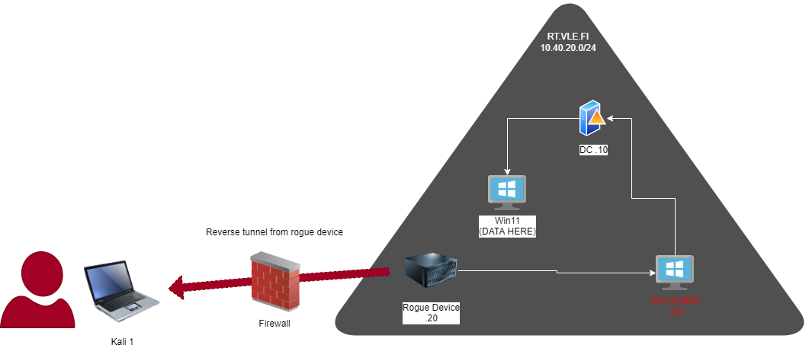
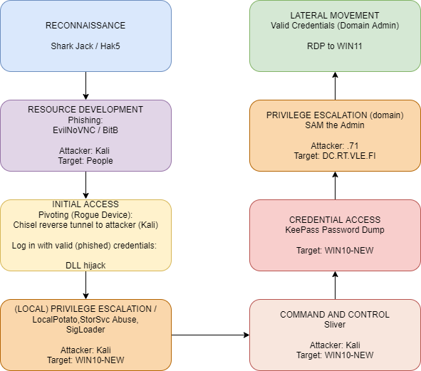

# Attack Chain

The attack path consists of the following steps:

- **Attacker**: Kali 1 (IP: x.x.x.x)
  - Gains initial access to the network via a reverse tunnel from the Rogue Device (.20).
  - The reverse tunnel allows the attacker to establish a connection from the Rogue Device to Kali 1, effectively bypassing network defenses and gaining a foothold within the target environment.

- **Lateral Movement**: Rogue Device (IP: 192.168.0.20) to WIN10-NEW (.103)

  - Once inside the network, the red team pivots from the Rogue Device to the target machine WIN10-NEW.
  - The lateral movement to WIN10-NEW (IP: 192.168.0.103) involves leveraging the compromised position of the Rogue Device to gain access to WIN10-NEW.

- **Pivoting**: WIN10-NEW (.103) to DC (.10)
  - From WIN10-NEW, the red team pivots through the DC (Domain Controller) ma-chine (IP: 192.168.0.10).
  - This pivot allows the red team to escalate privileges and establish control over the DC machine, which plays a crucial role in further stages of the attack chain.

- **Target Machine**: WIN11 
  - The ultimate target machine, WIN11, is where the data to be stolen is located.
  - This serves as the final objective within the attack chain.

 

 

 
  
 
The attack is designed to proceed according to a systematic progression of steps and demonstrate potential routes an attacker can take within the target environment. The subsequent sections focus on the tools employed in each stage of the attack chain.
