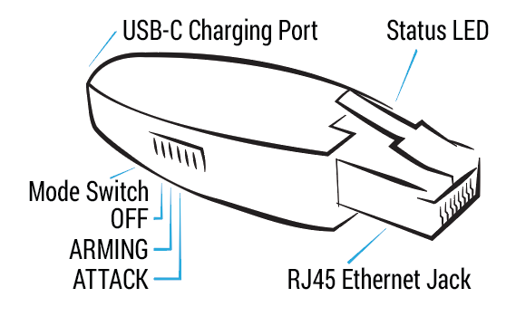

# Shark Jack

## Background

Shark Jack is a portable network attack and automation tool. It can be deployed against a target network for rapid reconnaissance, exfiltration and IT automation tasks. There are 3 modes: off, arming and attack. Modes can be selected by toggling a switch located on the side of the device.

 

# Arming
In arming mode, Shark Jack is configured with a static IP address of `172.16.24.1`. This allows a connection to be established with the device using SSH or HTTP protocols. Once connected, you have the ability to upload new payloads or review the results of previously executed payloads. The outcomes of payloads are automatically saved to the `/root/loot/` directory for easy access and analysis.

# Attack
In attack mode Shark Jack executes the `payload.sh` or `payload.txt` bash script located in the `/root/payload` directory. 
Pre-made scripts can be accessed from a dedicated [GitHub repository](https://github.com/hak5/sharkjack-payloads/tree/master/payloads/library).
Shark Jack utilizes an LED to indicate the device's status. During attack mode, LED behavior is controlled by the currently executing payload. Typically when the LED is blinking it signifies an action is being carried out. Once the LED turns off it indicates the payload has finished executing and the device can be safely disconnected.

