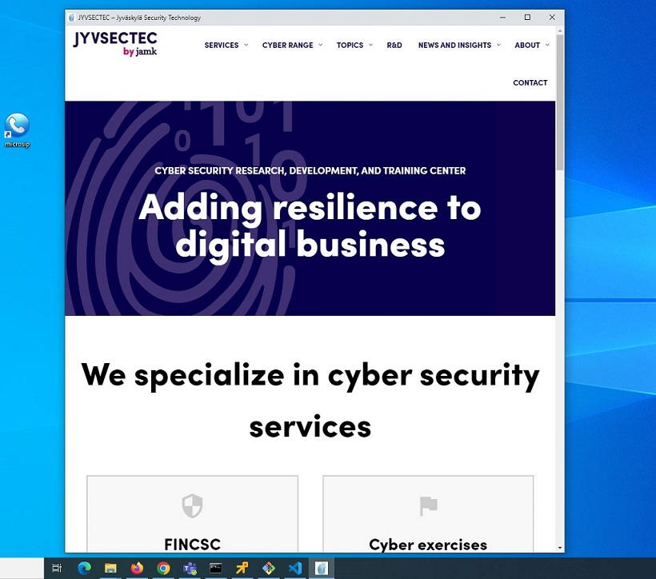
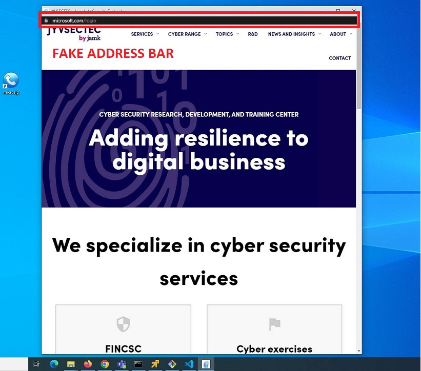
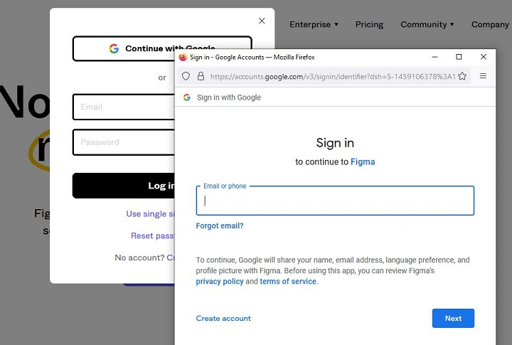
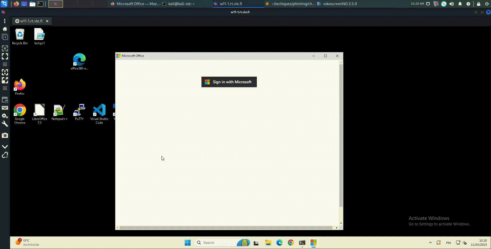
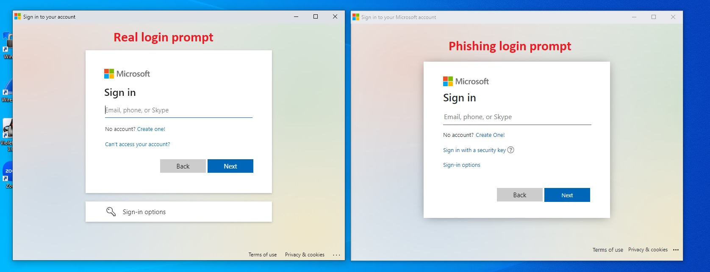
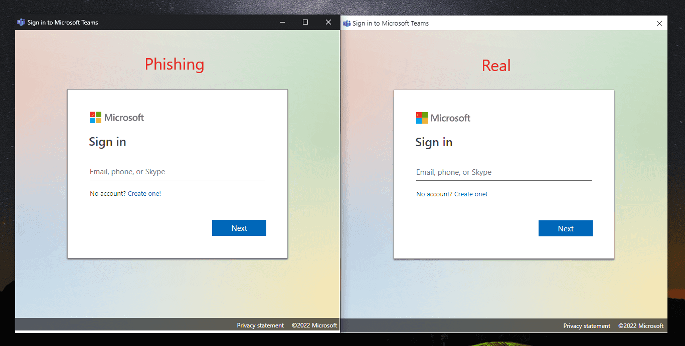

# Browser-in-browser attack

## Background

### Chromium application mode

Chromium based browsers (such as Chrome and Edge) support the ```--app``` commandline flag. This will launch a website in application mode which does several things:  

* Launched window is given a desktop application appearance rather than a browser appearance.
* Launches the website while hiding the address bar.
* Windows taskbar displays the website's favicon rather than the browser's.
* Causes the site to be launched in a seperate browser window.  

Commands to launch Chrome and Edge in application mode and open ```JYVSECTEC``` website:

```
# Microsoft Edge
"C:\Program Files (x86)\Microsoft\Edge\Application\msedge.exe" --app=https://jyvsectec.fi

# Chrome
"C:\Program Files\Google\Chrome\Application\chrome.exe" --app=https://jyvsectec.fi
```  

The above commands create the window shown below:  
  
We can see the Windows task bar displaying the site's favicon as the icon.  

## Inserting a fake address bar

Because the application mode hides the address bar, we can create a site with a fake address bar with some basic HTML/CSS:  

  
This is a local copy of the site edited with the fake URL bar.  

## Pop-up login window  
When authenticating to websites like Microsoft, Google etc. we're given a pop-up window that asks us to authenticate. The image below shows the window that appears when someone tries to login to Figma with their Google account:  

  

## Impersonating the pop-up login window  
Impersonating a pop-up login window is easy with some basic HTML/CSS knowledge. We can use an iframe to point to a malicious server hosting the phishing page and the results are telling:  

### Demo
  
## Impersonating endpoint software

With this technique, VPN, backup, Microsoft Office login software or pretty much anything can be impersonated if you have basic HTML/CSS skills.  

Here's an example of an impersonation of the Microsoft login when logging into Office 365:  

  
(This example can be found in this repository. It's a forked version of [JoniRinta-Kahila's spoofed MS login page](https://github.com/JoniRinta-Kahila/microsoft-login-spoof)).

Another example is from [Mr. D0x](https://mrd0x.com/phishing-with-chromium-application-mode/), where the Microsoft teams software login prompt is impersonated:  

  
The difference between real and fake phishing prompts can be very subtle and most likely will not cause alarm.

### Demo


## Linux & MacOS  

Chromium's application mode works on other operating systems the same way as per [Chromium's documentation](https://www.chromium.org/developers/design-documents/appmode-mac/).

## Useful tricks with JavaScript

The phishing site can control certain aspects of the window when launched.  

```window.close()``` - Closes the window. Can be used to terminate the window after user performs an action.  

```window.moveTo(x,y)``` - Positions the window. Use this to place the window to a certain area of the screen.  

```window.resizeTo(x,y)``` - Resizes the window. Use this to resize the window to match the software being impersonated.  

Determining the legitimacy of a URL when hovering over a link is not effective if JavaScript is enabled. The ```href``` -tag can be pointed to a legitimate site. This can be overridden with a simple ```onclick()``` -event:  

```
<a href="https://jyvsectec.fi" onclick="return launchWindow();">JYVSECTEC</a>

function launchWindow(){
    // Launch the your fake authentication window
    return false; // This will make sure the href attribute is ignored
}
```
## Detection  

### Dragging the window

One way of detecting a BitB attack is by dragging the window to the edge of the browser. If the window cannot escape the browser then it's not a real window.  

### Browser extension  

@odacavo released a browser extension that can detect and warn users about embedded iFrames. It's available [here](https://github.com/odacavo/enhanced-iframe-protection).
