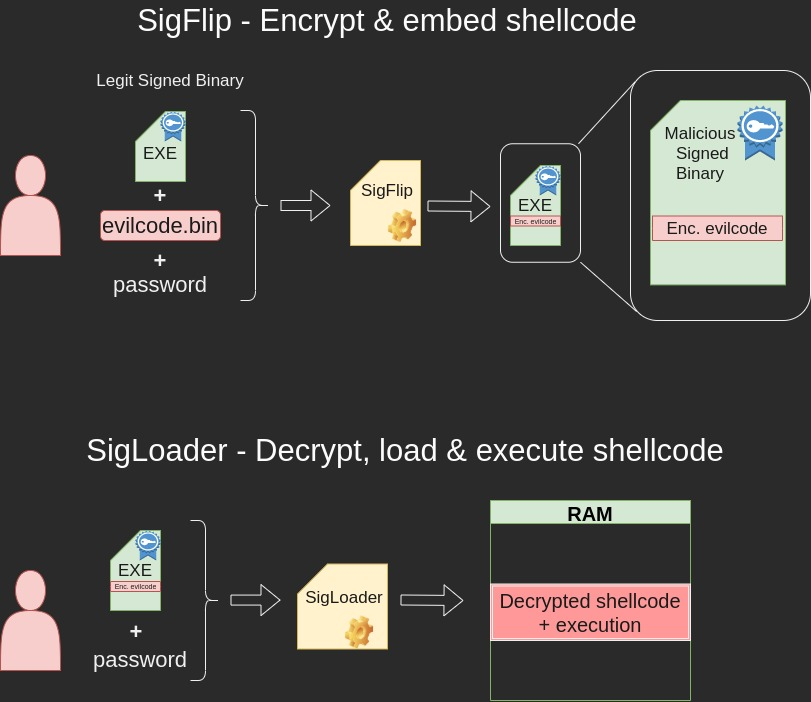

# SigFlip & SigLoader

## Background

These tools are used for embedding custom shellcode into a **signed** binary, and executing it in a victim system using *SigLoader.exe*. Note, that a  Windows machine is required for using this toolkit.

Since the (malicious) shellcode is encrypted, this method is quite certain to succeed in smuggling the shellcode to the victim host past any defensive measures.

Link to the original Git repository: 


For your convenience, 2 executables and 3 libraries have been already compiled using VS Studio. The ready-to-use toolbox includes 5 files listed in the table below.


|File | Function | Purpose |
|:-:|:-:|:-:|
|SigFlip.exe| Shellcode encrypter & injector| Execute in attacker's Windows machine|
|SigLoader.exe | Shellcode decrypter & loader | Execute in victim's Windows machine |
|vcruntime140d.dll| DLL required by SigLoader.exe| Transfer to victim machine with SigLoader |
|ucrtbased.dll| DLL required by SigLoader| Transfer to victim machine with SigLoader |
|ucrtbase.dll| DLL required by SigLoader| Transfer to victim machine with SigLoader |

<br>

The figure below illustrates the concept. Actions on the upper half are carried out on the attacking machine. Actions on the lower half of the figure are carried out on the target machine.




## About SigFlip and SigLoader

Two separate executables are used. 

#### SigFlip

**SigFlip** is a tool to embed shellcode into a digitally signed binary. Before embedding the shellcode to  PE file's WIN_CERTIFICATE *certificate table*, the shellcode is encrypted with a password provided by the user (symmetric encryption). 

The shellcode has to be separately generated in a raw binary format (as example,   `-f raw ` in Metasploit,   `-f shellcode` for Sliver  and so on).

This creates a new signed binary, which has the encrypted shellcode embedded into and a valid digital signature.
 

#### SigLoader

**SigLoader** is used in the victim system, to find the encrypted shellcode from the specified binary, decrypt it with a given password, load it into memory and execute it. 

Loader executable utilizes an egg-hunt style mechanic to find the shellcode's position by looking for a hex value *0xfeedface*. Once the shellcode is found, it is decrypted and loaded into memory, followed by execution. 


## Embedding shellcode to a signed binary

For testing purposes, a digitally signed binary *ChromeSetup.exe* is used. As shellcode, a Sliver beacon payload is used.

To encrypt a shellcode and embed it into a binary, following syntax is used:
```cmd
SigFlip.exe -i <ORIG_EXE> -s <SHCODE.BIN> -o <OUTFILE.EXE> -e <PASSWORD>

SigFlip.exe -i .\ChromeSetup.exe -s .\beacon.bin -o mod_chrome.exe -e password
```


## Executing the loader & shellcode on victim host

Deliver the loader files (SigLoader.exe + 3 DLLs) along with the *mod_chrome.exe* to the victim machine. 

To execute the encrypted shellcode inside the *mod_chrome.exe*, run the following command on the target system:

```cmd
SigLoader.exe mod_chrome.exe password
```

Below is a screenshot, where SigLoader was used to execute a Sliver beacon shellcode on Windows 10 with Defender up-to-date and active (11th May, 2023). 


The following screenshot shows Sliver server catching the callback from agent.


### Improvement ideas

General ideas for making the execution more stealthy:

- Run the command with *Run* as a hidden process
- Modify the source code to make SigLoader not print so suspicious texts
- Deliver 


## For blue teams

There are two kinds of traces left by SigLoader. The tool leaves static and dynamic traces to the victim machine. The following table below shows static traces related to the tool either directly or indirectly.


## Static traces 

### Detecting SigLoader

The following traces are related to the SigLoader binary. Every file listed below is not a certain indicator of compromise.

|Trace / type|Trace location | Hash |Presence indicator| Additional info|
|:-:|:-:|:-:|:-:|:-:|
|SigLoader.exe / file|Victim host|md5: `de452f0e70df61a3895bbb35245f0ff3`, sha1: `56cc0dfaf84a49828343800bf3fb11948b64d0f5`|100%| - |
|vcruntime140d.dll / file|Victim host|md5:`d3a035156204a412e8e69d7f8bcdc838`, sha1: `d5a77b1c62822d47b4bee8db1e84ddc1b3666c15`|<1%|Present also when VS Studio or another compiling tool is installed|
|ucrtbase.dll / file|Victim host|md5: `2c8fe06966d5085a595ffa3c98fe3098`, sha1:`e82945e3e63ffef0974d6dd74f2aef2bf6d0a908`|<1%|Usually installed to Windows by default(at least Win10),  [Info](https://learn.microsoft.com/en-us/cpp/windows/universal-crt-deployment?view=msvc-170) |
|ucrtbased.dll / file|Victim host|md5:`108b715a604d800501462fb648b82a75` sha1:`c9bec97e6033f60113581c76a97f5fc89f37520a`|<1%|Present also when VS Studio or another such tool is installed|


#### SigLoader binary - strings

When hunting SigLoader executable, strings of the suspicious executable may provide a strong indicator of the binary being SigLoader.

As example, the following string can be found from the SigLoader binary provided in the toolbox:

`C:\Users\user\Desktop\SigFlip-main\Native\SigLoader\x64\Debug\SigLoader.pdb`

The string above provides two hunting ideas:

1. Look for strings `sigflip` and `sigloader` (case insensitive) in the binary. If either one of these is present, the binary very likely is SigLoader.  


### Detecting the smuggling binary 

Since SigLoader is used for extracting and executing shellcode from a signed binary's certificate table, the signed binary can also be used as a possible indicator of compromise. However, the checksum or size of the signed binary can not be used to determine wether or not this binary is the "smuggling binary" (signed binary which has shellcode embedded into it). Size of the "smuggling binary"  depends heavily on the shellcode's size, and it's checksum practically is different in every case.

SigLoader searches the encrypted shellcode from a certificate table by looking for an entry of **two** sequential `0xfeedface` bytes. This provides a vector for detection:

|Trace / type| Trace location |Found in|Presence Indicator|Additional info|
|:-:|:-:|:-:|:-:|:-:|
|two sequential `0xfeedface` bytes / bytes|Victim host | A signed binary's certificate table|>90%|The "egg" hunted by the SigLoader, `feed face feed face`|


The following example Yara rule can be used to search for this  "egg":

```
rule SigLoaderEgg {
    strings:
	$hex_feedface = {FE ED FA CE FE ED FA CE}

    condition:
	$hex_feedface
}
```

