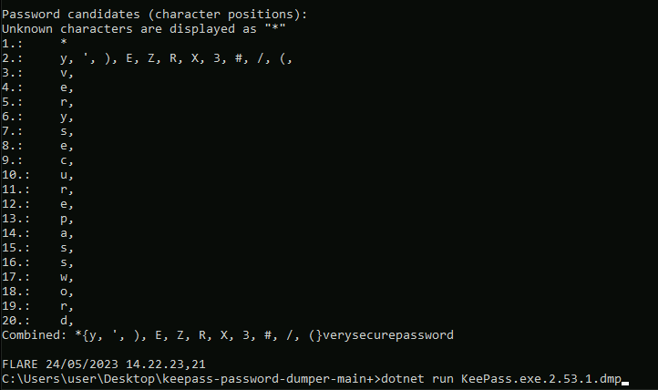

# KeePass Password Dumper

Works against KeePass versions:  <= 2.53.1  
Exploit code repository: https://github.com/vdohney/keepass-password-dumper

## Background

KeePass Password Dumper leverages vulnerability **CVE-2023-32784**  to obtain a fragment of the KeePass database master password. The tool works by reading a **memory dump** file containing a KeePass process dump. One of the following memory dump types can be utilized:

- KeePass process dump
- Swap file (Linux)
- pagefile.sys (Windows)
- hiberfile.sys (Windows, hibernation file)
- RAM dump of the entire system

The tool's success rate is very good. The tool typically recovers everything but the first character. For the second character the tool yields an array which contains the correct second character. The first character needs to be brute-forced. The second character should be fuzzed with the array containing the correct character. 

### Tool format

The tool comes in a format of a VS Studio C# project. There is no prebuilt binary because binaries cannot be built directly from the C# project. A way to execute the exploit against a memory dump file is to run the code with *dotnet* (shown later in the documentation).

### Practical exploitation requirements

- The KeePass version should be <= 2.53.1
- The (attacker) machine executing the C# exploit code against the memory dump should have **.NET SDK Framework v. 7.0** installed
- **Before** executing the memory dump, the (victim) user has to have a database active in KeePass processes 
- The (victim) user has to **type the password** to open the database with a master key (pasting from the clipboard will not work)

## Environment and tool setup

- Download and install <a href="https://dotnet.microsoft.com/en-us/download/dotnet/7.0">Microsoft .NET SDK v. 7.0</a> to the attacking machine 
- Get the exploit code repository to the attacking machine. A copy of the PoC repository is located in the *keepass-dumper* directory. The repository can be opened and cloned from the link below: 
	- https://github.com/vdohney/keepass-password-dumper

- Install a suitable version of KeePass (to the victim machine). Installers for versions **2.52** (.msi) and **2.53.1** (installer application) can be found in the directory *installers*. 
	- **note**: If the installer asks for permission to enable automatic update for KeePass, **deny the permission**

## Cracking the DB password

1. Acquire a memory dump containing the data of the whole KeePass process. It is recommended to move the dump file to the repository directory.

2. Run the dumper code in the repository directory using  the syntax below (PowerShell or Command prompt). The program will print a vast amount of output but the relevant part is at the end.

```powershell
dotnet run <PATH_TO_DUMP>

# example

dotnet run KeePass.dmp

```
The `dotnet` command must be executed in the directory which contains the C# code. 

3. Inspect and analyze the output. Take the required actions to either guess or brute-force the password. 

### Analysing the output

The figure below shows the relevant output after executing the dump code against a dump of KeePass version 2.53.1. 


<br>
Only the first character of the master password remained undiscovered. The output on different lines ( `Character position.:  OUTPUT` ) has the following logic:

1.   `1.:    *`        -> The first character is unknown
2.   `2.:   b,c,d,e,)`   -> The character number 2 is either `b, c, d, e`  or  `)`
3.  `3.:    c,`       -> The character number 3 is `c` 


