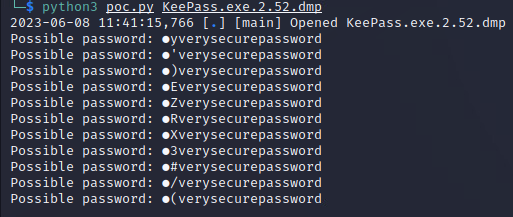

# KeePass Password Dumper

  

Works against KeePass versions:  <= 2.53.1  

Exploit code repository: https://github.com/CMEPW/keepass-dump-masterkey

  

## Background

  

KeePass Password Dumper leverages vulnerability **CVE-2023-32784**  to obtain a fragment of the KeePass database master password. The tool works by reading a **memory dump** file containing a KeePass process dump. One of the following memory dump types can be utilized:

  

- KeePass process dump

- Swap file (Linux)

- pagefile.sys (Windows)

- hiberfile.sys (Windows, hibernation file)

- RAM dump of the entire system

  

The tool's success rate is very good. The tool typically recovers everything but the first character. For the second character the tool yields an array which contains the correct second character. The first character needs to be brute-forced. The second character should be fuzzed with the array containing the correct character.

  


  

### Practical exploitation requirements

  

- The KeePass version should be <= 2.53.1

- **Before** executing the memory dump, the (victim) user has to have a database active in KeePass processes

- The (victim) user has to **type the password** to open the database with a master key (pasting from the clipboard will not work)

  

## Cracking the DB password

  

1. Acquire a memory dump containing the data of the whole KeePass process.

  2. Run python script to analyze the dump file
  ```
  python3 poc.py <PATH_TO_DUMP>
  
  example
  
  python3 poc.py KeePass.exe.2.52.dmp
  
```


  

### Analysing the output


The figure below shows the output of poc.py after it analyzed dump of KeePass version 2.52.
  



<br>

First character of the master password remained undiscovered. In this case program provided 11 different possibilities for the 2nd letter of the password. 
