# Dependency-Track

This guide is an abridged version of the usage recommendations provided by Dependency-Track. The official documentation can be found [here](https://docs.dependencytrack.org/getting-started/configuration/). A separate installation guide can be found [here](https://gitlab.labranet.jamk.fi/AB8910/jyvsectec/-/blob/main/sbom/README.md).

### Initial Startup

Multiple tasks occur when starting up Dependency-Track for the first time. These include:

* Generation of default objects such as users, teams, and permissions
* Generation of secret key used for JWT token creation and validation
* Population of CWE and SPDX license data
* Initial mirroring of all supported vulnerability datasources (National Vulnerability Database, GitHub Advisories, etc)

### Default Credentials

An administrative account is created on initial startup with the following credentials:

* username: admin
* password: admin

The admin user is required to change the password upon first login.

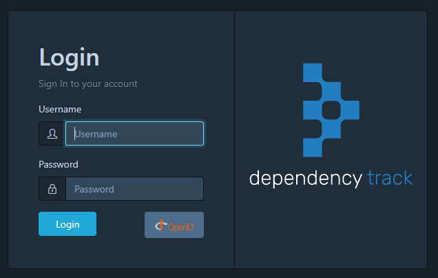

### Configuration

The UI works quite well out of the box. The default settings should in most cases be sufficient. The `application.properties` manages configuration and can be modified if changes are necessary. It resides in the classpath of the WAR (Web Application Resource) by default. The file controls many performance tuning parameters. It is most useful for defining optional external database sources, directory services (LDAP), and proxy settings.

The properties defined in the configuration file can also be specified as environment variables for containerised deployments. All environment variables are upper case with periods (.) replaced with underscores.

Add the system property alpine.application.properties when executing to start a custom configuration. For example:
```
-Dalpine.application.properties=~/.dependency-track/application.properties
```

## Recurring Tasks

Recurring tasks typically emit log messages whenever they start, complete, or fail unexpectedly. The task names listed below will be reflected in those log messages.

| Name                            | Description                                                      | Initial Delay | Default Interval         |
|---------------------------------|------------------------------------------------------------------|---------------|--------------------------|
| LdapSyncTask*                   | Synchronizes LDAP users                                         | 10s           | 6h                       |
| GitHubAdvisoryMirrorTask*       | Mirrors the GitHub Advisories database                         | 10s           | 24h                      |
| NistMirrorTask*                 | Mirrors the NVD database                                        | 1m            | 24h                      |
| EpssMirrorTask*                 | Mirrors the EPSS database                                       | -             | (Immediately after NistMirrorTask) |
| OsvMirrorTask*                  | Mirrors the OSV database                                        | 10s           | 24h                      |
| VulnDbSyncTask*                 | Mirrors the VulnDB database                                     | 1m            | 24h                      |
| PortfolioMetricsUpdateTask      | Updates time series metrics for all projects in the portfolio   | 10s           | 1h                       |
| VulnerabilityMetricsUpdateTask  | Updates time series metrics for the local vulnerability database | 10s           | 1h                       |
| VulnerabilityAnalysisTask       | Analyzes all components in the portfolio for vulnerabilities    | 6h            | 24h                      |
| RepositoryMetaAnalyzerTask      | Fetches repository metadata (e.g. latest versions) for all components in the portfolio | 1h            | 24h                      |
| InternalComponentIdentificationTask | Identifies internal components in the portfolio             | 1h            | 6h                       |
| ClearComponentAnalysisCacheTask | Clears internal caches used for vulnerability analysis with external sources (e.g. OSS Index) | 10s           | 72h                      |
| FortifySscUploadTask*           | Publishes findings to Fortify SSC                               | 5m            | 1h                       |
| DefectDojoUploadTask*           | Publishes findings to Defect Dojo                               | 5m            | 1h                       |
| KennaSecurityUploadTask*        | Publishes findings to Kenna Security                            | 5m            | 1h                       |
| IndexTask*                      | Perform existence, corruption and consistency checks on Apache Lucene indexes used for search | 3h            | 72h                      |

### Configuration

The interval of recurring tasks is configurable in the administration panel. Most of the intervals are configured in the Task scheduler section. Lucene index task intervals are configured in `Search` section. Some tasks can potentially put the system under high load, or take a long(er) time to complete. Choosing intervals that are too short may cause unexpected issues.

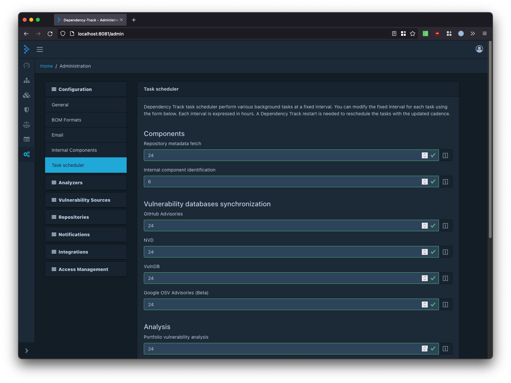

## Usage

### Standards

Dependency-Track fully complies with [U.S. Executive Order 14028](https://www.whitehouse.gov/briefing-room/presidential-actions/2021/05/12/executive-order-on-improving-the-nations-cybersecurity/). For software consumers this means the platform performs all the following tasks:

* Tracks all systems and applications that have SBOMs
* Upload SBOMs through the user interface or via automation
* Components defined in SBOMs will be analyzed for known vulnerabilities using multiple sources of vulnerability intelligence, including the NVD
* Displays all identified vulnerabilities and vulnerable components for every SBOM analyzed
* Upload CycloneDX VEX obtained from suppliers to gain insight into the vulnerable components that pose risk, and the ones that don’t
* Quickly identify all systems and applications that have a specific component or are affected by a specific vulnerability
* Helps to prioritize mitigation by incorporating support for the Exploit Prediction Scoring System (EPSS)
* Evaluate the portfolio of systems and applications against user-configurable security, operational, and license policies

## Analysis Types

### Known Vulnerability Analysis

Dependency-Track integrates with multiple sources of vulnerability intelligence to identify components with known vulnerabilities. The platform employs several methods of vulnerability identification including:

| Analyzer   | Description                                                                                                     |
|------------|-----------------------------------------------------------------------------------------------------------------|
| Internal   | Identifies vulnerable components from an internal directory of vulnerable software                           |
| OSS Index  | OSS Index is a service provided by Sonatype which identifies vulnerabilities in third-party components      |
| VulnDB     | VulnDB is a commercial service which identifies vulnerabilities in third-party components                     |
| Snyk       | Snyk is a commercial service which identifies vulnerabilities in third-party components                       |

### Outdated Component Analysis

Dependency-Track supports identification of outdated components by leveraging tight integration with APIs available from various repositories. The platform relies on Package URL (PURL) to identify the ecosystem a component belongs to and component metadata. It uses the data to query the various repositories capable of supporting the components ecosystem. 

### Licence Evaluation

The policy engine can evaluate component licenses against one or more policies.

### Component Identity

Components can be evaluated based on their identity. Identity in this context includes:

| Identity    | Description                                               |
|-------------|-----------------------------------------------------------|
| Coordinates | Matches components that contain the specified group, name, and version |
| Package URL | Matches components that have the specified Package URL    |
| CPE         | Matches components that have the specified CPE            |
| SWID TagID  | Matches components with the specified SWID TagID         |
| Hash        | Matches components with the specified hash               |

Hash identity automatically checks all supported hash algorithms.

Common uses for evaluating components based on their identity include:

* Organizational policy containing pre-defined list of allowed and/or prohibited components
* Identifying counterfeit and/or known malicious components

### Impact Analysis

Dependency-Track evaluates the potential impact of vulnerabilities in a given environment. It can help identify all affected projects across the organization. If the vulnerability is published to a datasource Dependency-Track supports (i.e. NVD, GitHub Advisories, OSS Index, VulnDB, etc), then simply looking up the vulnerability in the platform is all that is required.

Using Dependency-Track can help organizations answer two important questions:
 
* What is affected?
* Where am I affected?

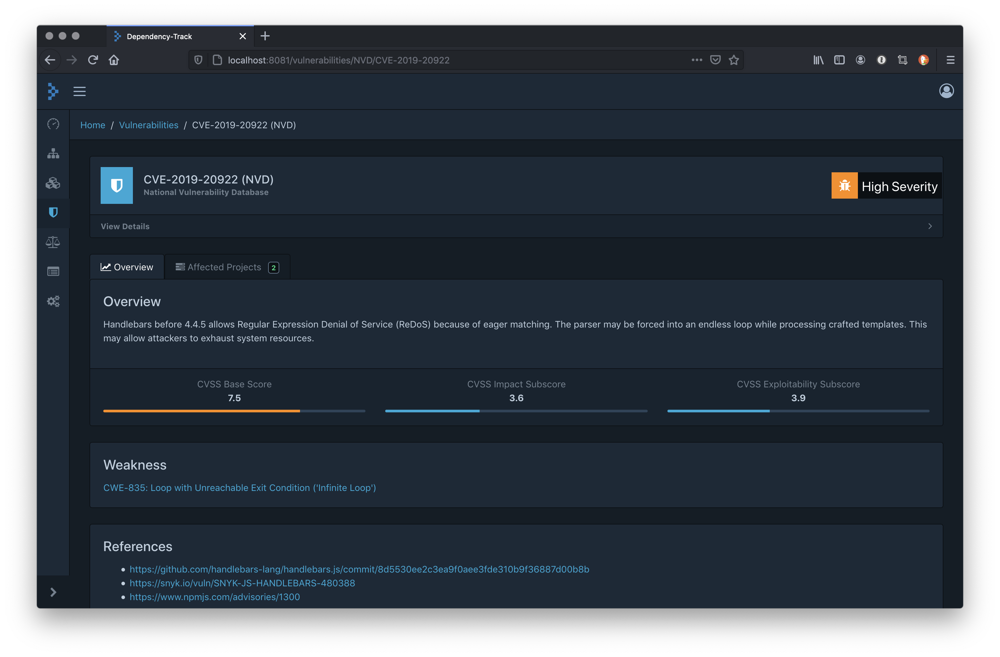

The platform contains a full mirror for each of the vulnerability datasources it supports. Virtually all public information about the vulnerability including the description, affected versions, CWE, and severity, are captured, as well as the affected projects. The list of affected projects is dynamically generated based on internally generated data.

Performing a search on a component will reveal a list of vulnerabilities if the component name and version are known. The search output will also list all projects with a dependency on the component.

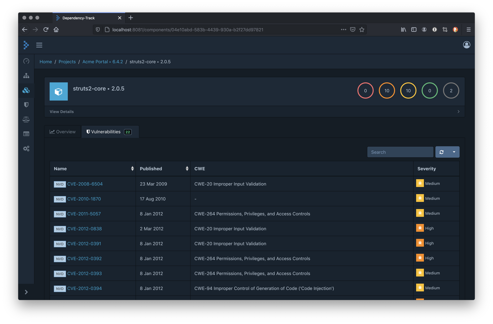

## Policies

Policies can be created and policy violations measured across the portfolio and against individual projects and components. They are configurable and can be enforced for the portfolio or limited to specific projects. Policies are evaluated when an SBOM is uploaded.

There are three types of policy violations:

* License
* Security
* Operational

### License Violation

Policy conditions can specify zero or more SPDX license IDs as well as license groups. Dependency-Track comes with pre-configured groups of related licenses (e.g. Copyleft) that provide a starting point for organizations to create custom license policies.

### Security Violation 

Policy conditions can specify the severity of vulnerabilities. A vulnerability affecting a component can result in a policy violation if the policy condition matches the severity of the vulnerability. Vulnerabilities that are suppressed will not result in a policy violation.

### Organisational Violation

It is possible to create lists of allowable and/or prohibited components. Policy conditions can specify zero or more:

* Coordinates (group, name, version)
* Package URL
* CPE
* SWID Tag ID
* Hash (MD5, SHA, SHA3, Blake2b, Blake3)

### Procurement

It is possible to evaluate vendor-supplied SBOMs in Dependency-Track. The platform evaluates these according to the [OWASP Software Component Verification Standard (SCVS)](https://owasp.org/scvs). This necessitates creating a new project correspondnig to the software and version being procured. Once this has been completed the SBOM can be uploaded for analysis. The analysis includes a complete visibility of component inventory, vulnerabilities, outdated component status, and policy violations.

## Analysis States

An analysis decision can be made for each finding when triaging results. The following states are supported:

| State          | Description                                                                        |
|----------------|------------------------------------------------------------------------------------|
| EXPLOITABLE    | The finding is exploitable (or likely exploitable)                                |
| IN_TRIAGE      | An investigation is in progress to determine if the finding is accurate and affects the project or component |
| FALSE_POSITIVE | The finding was identified through faulty logic or data (i.e. misidentified component or incorrect vulnerability intelligence) |
| NOT_AFFECTED   | The finding is a true positive, but the project is not affected by the vulnerability identified |
| NOT_SET        | Analysis of the finding has not commenced 

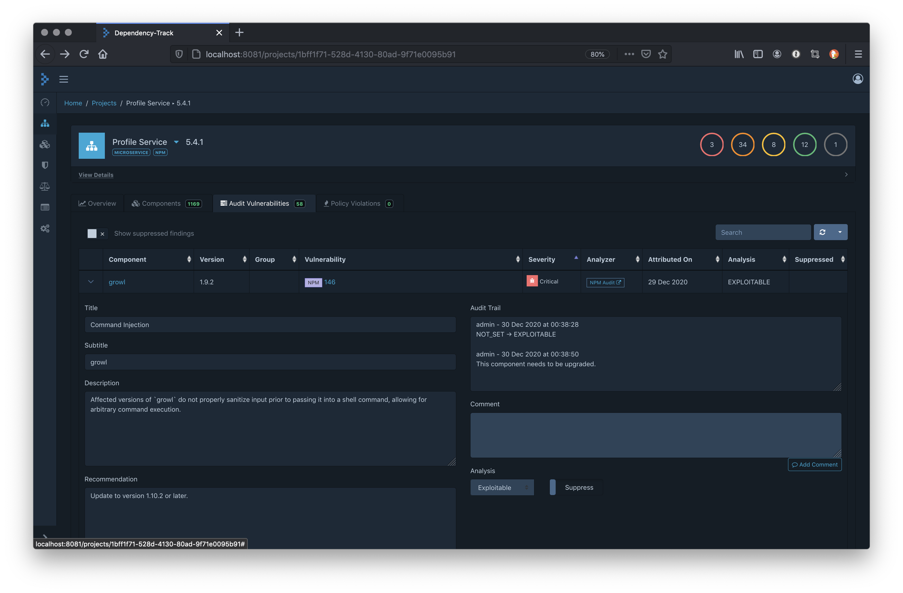

Individual findings can be suppressed regardless of analysis state. Suppressed findings will have a positive impact on metrics whereas findings that are not suppressed will not.

Suppressed findings may:

* Decrease the number of `Portfolio Vulnerability` metrics
* Decrease the number of `Vulnerable Project` metrics
* Decrease the number of `Vulnerable Component` metrics
* Decrease the number of vulnerabilities in specific components
* Decrease the `Inherited Risk Score`

Findings that are not suppressed will continue to have an impact on all metrics. A finding will remain in the specified state unless a user removes the suppression from the finding. It is considered best practice to suppress findings with an analysis state of NOT_AFFECTED or FALSE_POSITIVE. This allows the inherited risk and corresponding metrics to be taken into consideration when drawing analytical conclusions. Suppressed findings will have a positive impact on Dependency-Track as well as the metrics of external systems such as Kenna Security or ThreadfiFix. Such systems will also assume vulnerabilities associated with suppressed findings have been resolved.

## Integrations

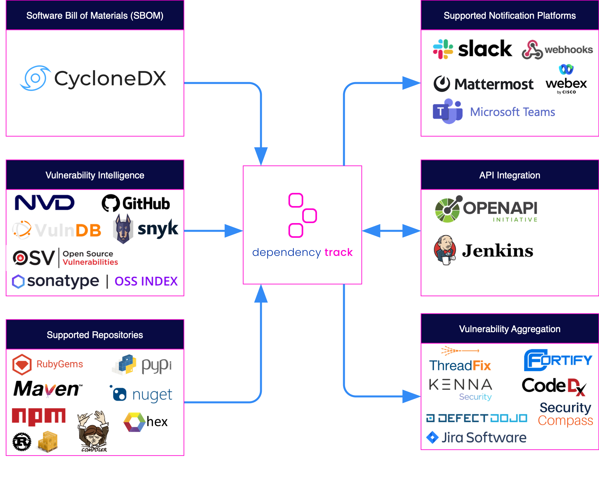

### Notifications

The platform features a robust and configurable notification framework capable of alerting users or systems to the presence of newly discovered vulnerabilities, previously known vulnerable components that are added to projects, as well as providing notifications on various system and error conditions.

There are two types of notifications:

| Scope     | Description                                                                         |
|-----------|-------------------------------------------------------------------------------------|
| SYSTEM    | Notifications on system-level informational and error conditions                  |
| PORTFOLIO | Notifications on objects in the portfolio such as vulnerabilities and audit decisions |

Each scope contains a set of notification groups that can be used to subscribe to.

| Scope     | Group                | Description                                                                                                                   |
|-----------|----------------------|-------------------------------------------------------------------------------------------------------------------------------|
| SYSTEM    | ANALYZER             | Notifications generated as a result of interacting with an external source of vulnerability intelligence                    |
| SYSTEM    | DATASOURCE_MIRRORING | Notifications generated when performing mirroring of one of the supported datasources such as the NVD                        |
| SYSTEM    | INDEXING_SERVICE     | Notifications generated as a result of performing maintenance on Dependency-Tracks internal index used for global searching |
| SYSTEM    | FILE_SYSTEM          | Notifications generated as a result of a file system operation. These are typically only generated on error conditions      |
| SYSTEM    | REPOSITORY           | Notifications generated as a result of interacting with one of the supported repositories such as Maven Central, RubyGems, or NPM |
| PORTFOLIO | NEW_VULNERABILITY    | Notifications generated whenever a new vulnerability is identified                                                         |
| PORTFOLIO | NEW_VULNERABLE_DEPENDENCY | Notifications generated as a result of a vulnerable component becoming a dependency of a project                       |
| PORTFOLIO | GLOBAL_AUDIT_CHANGE  | Notifications generated whenever an analysis or suppression state has changed on a finding from a component (global)         |
| PORTFOLIO | PROJECT_AUDIT_CHANGE | Notifications generated whenever an analysis or suppression state has changed on a finding from a project                  |
| PORTFOLIO | BOM_CONSUMED         | Notifications generated whenever a supported BOM is ingested and identified                                                |
| PORTFOLIO | BOM_PROCESSED        | Notifications generated after a supported BOM is ingested, identified, and successfully processed                         |
| PORTFOLIO | BOM_PROCESSING_FAILED| Notifications generated whenever a BOM upload process fails                                                                |
| PORTFOLIO | POLICY_VIOLATION     | Notifications generated whenever a policy violation is identified                                                           |


### Publishers

Notification publishers allow users to describe the structure of a notification (i.e. MIME type, template) and how to send a notification (i.e. publisher class). The following notification publishers are included by default:

| Publisher  | Description                                           |
|------------|-------------------------------------------------------|
| Slack      | Publishes notifications to Slack channels             |
| Teams      | Publishes notifications to Microsoft Teams channels   |
| Mattermost | Publishes notifications to Mattermost channels       |
| WebEx      | Publishes notifications to Cisco WebEx channels      |
| Webhook    | Publishes notifications to a configurable endpoint   |
| Email      | Sends notifications to an email address              |
| Console    | Displays notifications on the system console         |
| Jira       | Publishes notifications to Jira                      |


### Notification Templates

Dependency-Track uses [Pebble Templates](https://pebbletemplates.io/) to generate notifications. The template context is enhanced with the following variables:

| Variable               | Type             | Description                                                  |
|------------------------|------------------|--------------------------------------------------------------|
| timestampEpochSecond   | long             | The notification timestamp in epoch seconds                 |
| timestamp              | string           | The notification local date time in ISO 8601 format         |
| notification.level     | enum             | One of INFORMATIONAL, WARNING, or ERROR                      |
| notification.scope     | string           | The high-level type of notification. SYSTEM or PORTFOLIO    |
| notification.group     | string           | The specific type of notification                           |
| notification.title     | string           | The notification title                                      |
| notification.content   | string           | The notification content                                    |
| notification.timestamp | LocalDateTime   | The notification local date time                            |
| notification.subject   | Object           | An optional object containing specifics of the notification |
| baseUrl                | string           | Dependency Track base URL                                   |
| subject                | Specific         | An optional object containing specifics of the notification |
| subjectJson            | javax.json.JsonObject | An optional JSON representation of the subject            |


## Notification Types

### NEW_VULNERABILITY 

This type of notification will always contain:

* 1 component
* 1 vulnerability
* 1 or more affected projects

### NEW_VULNERABLE_DEPENDENCY  

* component
* vulnerability
* 1 or more vulnerabilities

### PROJECT_AUDIT_CHANGE and GLOBAL_AUDIT_CHANGE

This type of notification will always contain:

* 1 component
* 1 vulnerability
* 1 analysis
* 1 or more affected projects

In the case of PROJECT_AUDIT_CHANGE, the list of affected projects will always be equal to 1. GLOBAL_AUDIT_CHANGE notifications will list all projects currently affected.

Audit change notifications are fired whenever the analysis state changes or when the finding is suppressed or unsuppressed.

### BOM_CONSUMED and BOM_PROCESSED

This type of notification will always contain:

* 1 project
* 1 bom

## Configuring Notifications

Creating notifications can be performed from the administrative page which requires the SYSTEM_CONFIGURATION permission. Notifications are configured in two easy steps. First create a new alert by specifying the name, scope, notification level, and publisher to use.

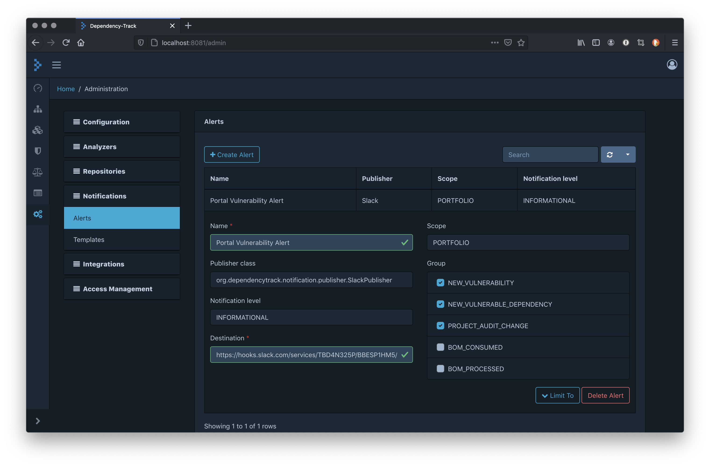

Creating notifications can be performed from the administrative page which requires the SYSTEM_CONFIGURATION permission. Notifications are configured in two easy steps. First create a new alert by specifying the name, scope, notification level, and publisher to use.

Once the alert is created it can be configured. Start with selecting from the list of available notification groups to notify on. Then specify the destination:

* Email publisher: a comma separated list of email addresses
* Slack, Mattermost and Microsoft Teams: the incoming webhook URL generated from each respective
* Jira: the project key where the issue will be created. The Jira alert also asks for the Jira ticket type (‘Task’, ‘Story’, etc., refer to the Jira documentation for more details) to be created
* For the Outbound Webhook publisher: a URL to which to publish the notification

By default, portfolio notifications are published regardless of which project is affected. This behavior can be altered by optionally limiting the projects. Expand the ‘Limit To’ button to reveal and configure the list of projects.

### Teams

Add channel to teams.

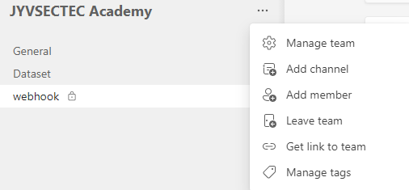

Add and configure `Incoming Webhook`:

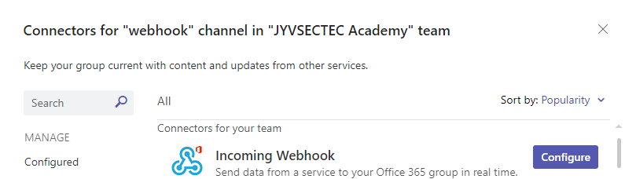

Add name to webhook.

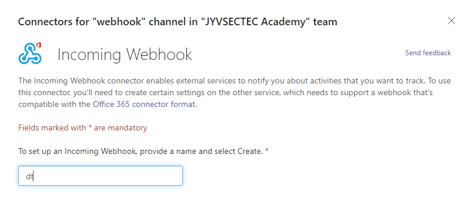

Copy webhook URL to Dependency-Track.

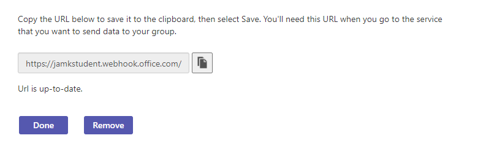

Example message.

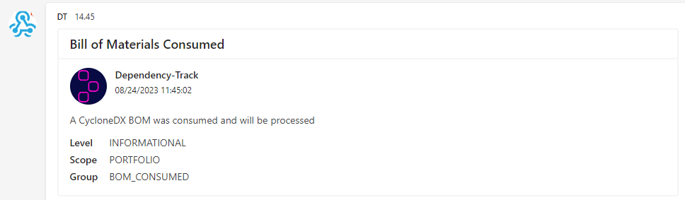

## Grafana

The Dashboard is fully customisable. Common Grafana dashboards for Micrometer should work without additional configuration. The available metrics can be tailored to individual needs. 

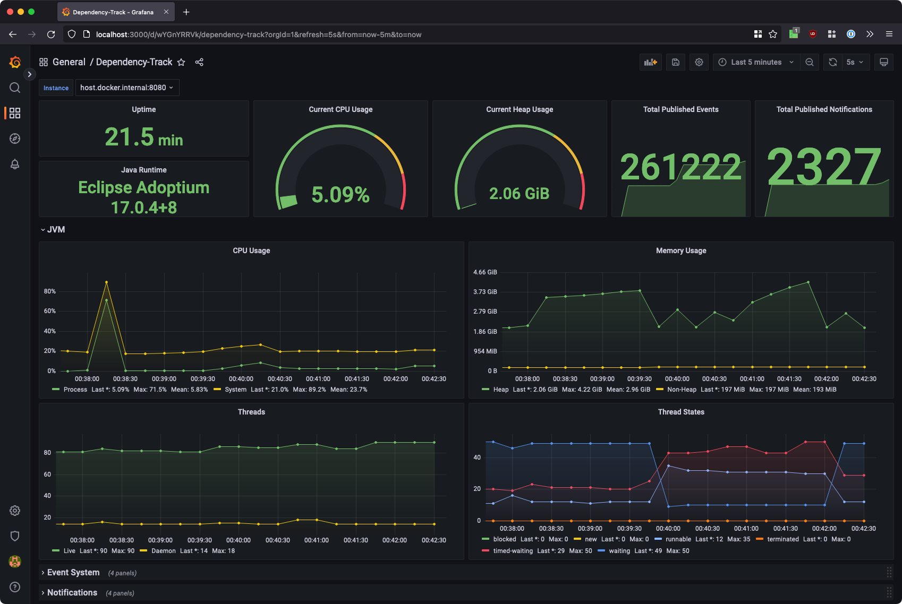
