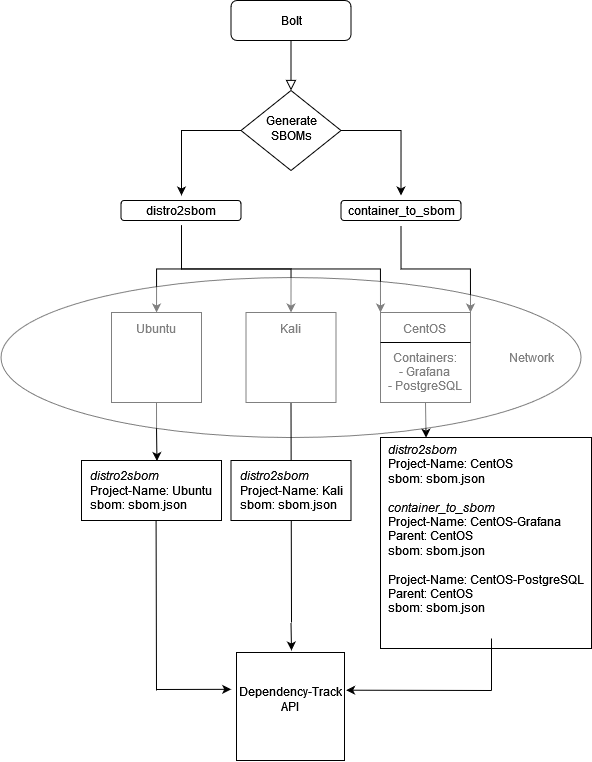

# Script Delivery Automation

## Bolt

### Background
Bolt is an open source orchestration tool that automates the manual work it takes to maintain your infrastructure. It can be installed on local workstations and connect directly to remote targets with SSH or WinRM. It is used to automate the execution of the scripts used to generate container and target-machine SBOMs.

### File structure
`Boltdir/modules/sboms/tasks/` is the directory in which scripts are stored. When running bolt the script can be specified with `sboms::yourscript`. The SBOM directory can be named anything. 
`Boltdir/inventory.yaml` stores information about the machines on which the scripts will be run. SSH keys are stored in `/Boltdir/keys/{ssh_key}`.

### Usage 
Run the `distro2sbom` script on an Ubuntu machine.
```
sudo docker run --mount type=bind,source=/home/kali/jyvsectec/jyvsectec/sbom/Boltdir,destination=/Boltdir puppet/puppet-bolt task run sboms::distro2sbom --run-as=user -t Ubuntu
```
Run the `container2sbom` script on an Ubuntu machine. Root privileges are required when executing the `container2sbom` script.
```
sudo docker run --mount type=bind,source=/home/kali/jyvsectec/jyvsectec/sbom/Boltdir,destination=/Boltdir puppet/puppet-bolt task run sboms::container2sbom --run-as=root -t Ubuntu
```

Boltdir needs to be mounted to Docker when running Bolt in a Docker container. 
```
--mount type=bind,source=/home/kali/jyvsectec/jyvsectec/sbom/Boltdir,destination=/Boltdir
```
You can specify the task you want to run by changing the  `module::taskname` option; in this case it is `sboms::distro2sbom`. The target can be specified with the -t flag. The value of the -t flag correlates to the name tag in the `inventory.yaml` file. The `-t Ubuntu` flag can be found in the Distro2sbom setup script.

## Bolt workflow


## Container2sbom

The `container2sbom` script is used to generate SBOMs for Docker containers. The SBOMs are then sent to the Dependency-Track API. A unique name is generated by appending the hostname to the container name. The project is organized as a child to the parent project. 


## Distro2sbom

Distro2sbom generates an SBOM (Software Bill of Materials) for either an installed application or a complete system installation. An SBOM for an installed package will identify all of its dependent components. Further information [here](https://pypi.org/project/distro2sbom/). 

The Distro2sbom shell script that Bolt runs utilizes the Distro2sbom python package to generate SBOMs. The resulting data are sent to the Dependency-Track API where they are stored and analyzed. Machine hostnames are used as project names when creating a new project in Dependency-Track. <b>Machines cannot have the same hostname. Naming conventions should account for this when scanning multiple machines with the same hostname.</b> When the distro2sbom script is executed for the first time it will create a file in `~/.dep_data`. This is where Dependency-Track project IDs are stored.  When Distro2sbom is executed again the same ID is used to update the project. 

### Requirements
* Python 3.7 or higher
* Pip

## API access
Distro2sbom needs a Dependency-Track API key with the following permissions: `PROJECT_CREATION_UPLOAD`, `BOM_UPLOAD`, `PORTFOLIO_MANAGEMENT`, `VIEW_PORTFOLIO`. An API key can be created [here](http://198.19.14.91:8080/admin/accessManagement/teams). API permissions vary according to the task. It is not advisable to assign full permissions to an API key if this is not required. 


### Examples

There can be multiple targets in one `inventory.yaml` file. Here a target named `SIEM-Rocky` is authenticated with a username and password. The `Ubuntu` machine is authenticated with an SSH key. This is saved in the `/Boltdir/keys/` directory.

### `ìnventory.yaml`
```yaml
targets:
  - uri: 198.19.14.92
    name: SIEM-Rocky

    config:
      transport: ssh
      ssh:
        user: user1
        password: password
        host-key-check: false
        
  - uri: 198.19.14.99
    name: Ubuntu
    config:
      transport: ssh
      ssh:
        user: user
        private-key: /Boltdir/keys/ubuntu_ssh_key
        host-key-check: false
        
  - uri: 198.19.14.84
    name: ELK-DA
    config:
      transport: ssh
      ssh:
        user: user
        password: pass
        host-key-check: false
        
  - uri: 198.19.14.91
    name: SIEM-DA
    config:
      transport: ssh
      ssh:
        user: user
        password: pass
        host-key-check: false
```

### `container2sbom.sh`
```bash
#!/bin/bash
dep_track_api="http://198.19.14.91:8081"
dep_track_bom=$dep_track_api"/api/v1/bom"
dep_track_api_key="X-API-Key: 9mji0NeOJ88k5cBftiD3rgxGDswRmQ7w"
#Install grype
if ! which grype &>/dev/null; then
    echo "Grype not installed installing grype"
    $(curl -sSfL https://raw.githubusercontent.com/anchore/grype/main/install.sh | sh -s -- -b /usr/local/bin)
fi

# Note: This is a synthesis of the send-to-api.sh and send-children-to-api scripts located at /sbom/dependency-track/scripts/

# Output directory to save the CycloneDX JSON files
OUTPUT_DIR=~/sboms

# Create the output directory if it doesn't exist
curl -sSfL https://raw.githubusercontent.com/anchore/grype/main/install.sh | sh -s -- -b /usr/local/bin
mkdir -p "$OUTPUT_DIR"

# Get the list of container names using `docker container ps`
docker_container_names=$(sudo docker container ps --format "{{.Image}}")
echo $docker_container_names

# Iterate through each container name and scan using Grype
for container_name in $docker_container_names; do
    # Clean up container name
    clean_container_name=${container_name//\//-}
    # Run Grype to scan the container and save the JSON output
    grype $container_name -o cyclonedx-json > $OUTPUT_DIR/$clean_container_name.json
done
project_location=$(find / -name project_id 2>/dev/null |grep "dep_data" | sed -n '1p')
PROJECT_UUID=$(cat $project_location)
FILES="$(ls ~/sboms/)"
echo $FILES
echo "$PROJECT_UUID"
host=$(hostname)
for f in $FILES; do
    echo $f
        project_name=$(echo $f | awk '{ print substr( $0, 1, length($0)-5 ) }')
        project_name=${host}-${project_name}
        sbom_loc=$OUTPUT_DIR"/"$f
        echo $sbom_loc
    curl -X "POST" $dep_track_bom -H 'Content-Type:multipart/form-data' -H "$dep_track_api_key" -F "autoCreate=true" -F "projectName=$project_name" -F "projectVersion=1" -F "bom=@$sbom_loc" -F "parentUUID=$PROJECT_UUID"
done
rm -r "$OUTPUT_DIR"
```
### `distro2sbom.sh`
```bash
#!/bin/bash
dep_track_api="http://10.40.20.91:8081"
dep_track_project=$dep_track_api"/api/v1/project"
dep_track_bom=$dep_track_api"/api/v1/bom"
dep_track_api_key="X-API-Key: IPxr0yAABscUJxBFlcEqzh8REohKu25A"
#check python version
if ! python3 -c 'import sys; assert sys.version_info <= (3,7)' 2> /dev/null; then 
    echo "Valid python version"
else
    python_version=$(python3 --version)
    echo $python_version
    echo "Invalid python version. 3.7 or higher is required"
    exit 1;
fi
#check if pip is installed
if  pip --version 2>/dev/null || pip3 --version 2>/dev/null; then 
    echo "Pip found"
else
    echo "Pip not found!"
    exit 1;
fi

dep_folder=~/.dep_data
dep_project_name=$(hostname)
distro_name=$(cat /etc/os-release | grep -E '^(NAME)=' | grep -Eo '["\047].*["\047]' | tr -d '"')
version=$(uname -r)
#If dependency track folder is found means that this machine already has project in dependency track.
if [ -d $dep_folder ] 
then
    echo "Directory $dep_folder exists."
    #Read projects id from the file. This will be used to send data to dependency track
    project_id=$(cat $dep_folder/project_id)
else
    #If "~/.dep_track" folder is not located new project is created to dependency track and its id is saved to .bolt_data.
    echo "Directory $dep_folder does not exists."

    #Machines hostname is used as project name. This means same dependency track instance can't be used across multiple networks. Project naming convention can be changed easily. 
    curl_response=$(curl -w '{"status_code":"%{http_code}"}' --silent -X "PUT" $dep_track_project -H 'Content-Type: application/json' -H "$dep_track_api_key" -d '{"name":"'$dep_project_name'","parent":null,"classifier":"OPERATING_SYSTEM","tags":[],"active":true}')
    echo $curl_response
    project_status=$(echo $curl_response | grep -o '"status_code":"[^"]*' | grep -o '[^"]*$')
    if ! [ "$project_status" = "201" ]; then
        #You might have tried to create new project with name that is already exists
    	echo "Could not create new project to dependency track. There might be project with the same name already created. "
        echo $curl_response
    else
        #If new project is created to dependency track "~/.dep_folder" folder will be created. "~/.bolt_data" will have file called project_id that will contain this projects id
    	project_id=$(echo $curl_response | grep -o '"uuid":"[^"]*' | grep -o '[^"]*$')
    	mkdir $dep_folder

    	echo $project_id > $dep_folder/project_id
    	echo "New project created"
        


    fi
fi

#Path where distro2sbom is installed.

echo "Installing distro2sbom"

pip install distro2sbom
distro2sbom_path=$(find / -name distro2sbom 2>/dev/null | grep /bin/ | sed -n '1p')
#Get distro type
if which dpkg &>/dev/null; then
    distro_type='deb'
elif which rpm &>/dev/null; then
    distro_type='rpm'
else
    distro_type='auto'
fi

echo "Running distro2sbom this might take few minutes"

command="${distro2sbom_path} --distro '$distro_type' --name '$distro_name' --release '$version' --system --format json --sbom cyclonedx --output-file distro2sbom_cyc.json"
bash -c "$command"
#add project id and bom to file
echo -n '{"project":"'$project_id'","bom":"' > json_beg.txt
#base64 encode results and add to same file
echo $(base64 distro2sbom_cyc.json)\"\} >> json_beg.txt
#delete spaces
cat json_beg.txt | tr -d " " > payload.json
curl -X "PUT" $dep_track_bom -H 'Content-Type: application/json' -H "$dep_track_api_key" -d @payload.json 
rm json_beg.txt
rm distro2sbom_cyc.json
rm payload.json
```
