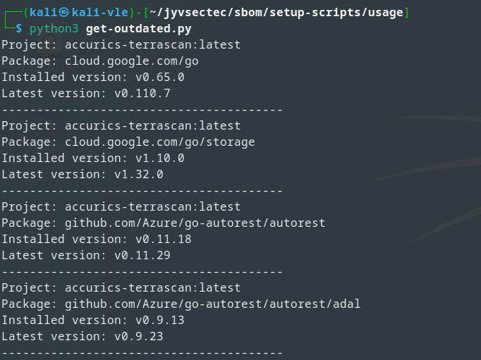
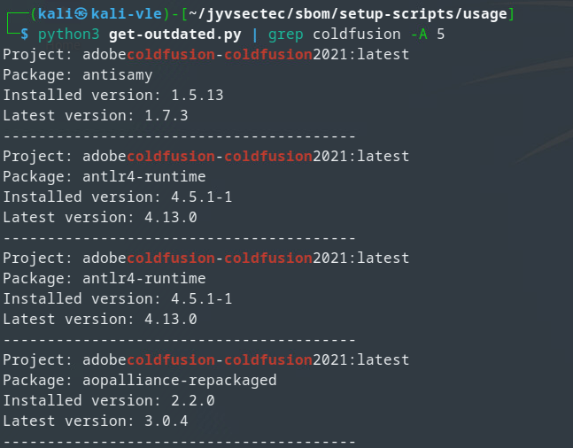

# Scanning Outdated Components

## Overview

This section provides a general overview of the `get-outdated` script functionality and its intended use in conjunction with a locally installed instance of Dependency Track. 

The script is designed to assist network infrastructure monitoring by interacting with Dependency-Track. It gathers information about projects, their components and versions. It compares the installed version of each component with the latest available version and highlights inconsistencies.

## Setup

* Ensure Python is installed on your system.
* Install required libraries. In the terminal run `pip install requests`.

### Script Modification

* Configure the domain and headers variables to match your Dependency Track instance's URL and API key.
* The `project_path` variable may need to be adjusted if your API endpoint differs.

### Running the Script

Run the script with the command `python3 get-outdated.py`

The script will then retrieve project UUIDs, gather component information, compare versions, and print inconsistencies.

#### `get-outdated.py`
```python
#!/bin/bash
dep_track_api="http://198.19.14.91:8081"
dep_track_bom=$dep_track_api"/api/v1/bom"
dep_track_api_key="X-API-Key: 9mji0NeOJ88k5cBftiD3rgxGDswRmQ7w"
#Install grype
if ! which grype &>/dev/null; then
    echo "Grype not installed installing grype"
    $(curl -sSfL https://raw.githubusercontent.com/anchore/grype/main/install.sh | sh -s -- -b /usr/local/bin)
fi

# Note: This is a synthesis of the send-to-api.sh and send-children-to-api scripts located at /sbom/dependency-track/scripts/

# Output directory to save the CycloneDX JSON files
OUTPUT_DIR=~/sboms

# Create the output directory if it doesn't exist
curl -sSfL https://raw.githubusercontent.com/anchore/grype/main/install.sh | sh -s -- -b /usr/local/bin
mkdir -p "$OUTPUT_DIR"

# Get the list of container names using `docker container ps`
docker_container_names=$(sudo docker container ps --format "{{.Image}}")
echo $docker_container_names

# Iterate through each container name and scan using Grype
for container_name in $docker_container_names; do
    # Clean up container name
    clean_container_name=${container_name//\//-}
    # Run Grype to scan the container and save the JSON output
    grype $container_name -o cyclonedx-json > $OUTPUT_DIR/$clean_container_name.json
done
project_location=$(find / -name project_id 2>/dev/null |grep "dep_data" | sed -n '1p')
PROJECT_UUID=$(cat $project_location)
FILES="$(ls ~/sboms/)"
echo $FILES
echo "$PROJECT_UUID"
host=$(hostname)
for f in $FILES; do
    echo $f
        project_name=$(echo $f | awk '{ print substr( $0, 1, length($0)-5 ) }')
        project_name=${host}-${project_name}
        sbom_loc=$OUTPUT_DIR"/"$f
        echo $sbom_loc
    curl -X "POST" $dep_track_bom -H 'Content-Type:multipart/form-data' -H "$dep_track_api_key" -F "autoCreate=true" -F "projectName=$project_name" -F "projectVersion=1" -F "bom=@$sbom_loc" -F "parentUUID=$PROJECT_UUID"
done
rm -r "$OUTPUT_DIR"
```

### Interpreting Results

* The script will display information about components with version inconsistencies between installed and latest versions.
* Project name, package, installed version, and latest version is displayed.



It is possible to grep for specific components. The `-A 5` flag is recommended to view the entire entry contents.



