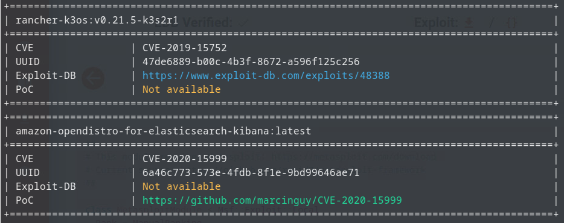

# Vulnerability Management

This guide provides a general overview of how to use the `pocsploit` script.

## Leveraging Vulnerabilities in Affected Projects

### Overview

`Pocsploit` is a synthesis of the `exploit-db-vulns` and `git-poc` scripts. The script is designed to fetch information about known exploited vulnerabilities and the projects they affect. It gathers data from the the Cybersecurity and Infrastructure Security Agency (CISA's) Known Exploited Vulnerabilities (KEV) catalogue via the Dependency-Track API. CVEs are then checked against exploits available at [Exploit-DB](https://www.exploit-db.com/) using Kali's `Searchsploit` tool. Proof of Concept (Poc) exploits are sourced from [GitHub](https://github.com/nomi-sec/PoC-in-GitHub). The repository houses an extensive archive of PoCs dating back to 1999 and is updated regularly. 

### Setup

* The `api_base_url` and `api_key` variables should be modified with appropriate values from the relevant Dependency Track instance.
* Change permissions with the command `chmod +x pocsploit.sh`.
* Save the script.

## Usage

* The script is run with the command `./pocsploit.sh`.
* Wait for the script to complete. It will fetch vulnerability and project data from the abovementioned sources and print links to the terminal. 
* Links and availability have been colour-coded for greater readability. Exploit-DB links are blue and PoC links are green. The text "Not available" appears in yellow when no exploit is available. 



* Information concerning vulnerabilities affecting specific components can be grepped. This reduces the need for full scans. The `-B` and `-A` flags can be used.
 


### Output

* The script will display information about affected projects and vulnerabilities in the terminal.
* Large ecosystems can potentially take time to scan. 
* PoCsploit can be run as a cron-job to circumvent this issue. Information can easily be outputted to a file for further processing.

### `pocsploit.sh`
```bash
#!/bin/bash

# This script can be used to quickly identify projects in the Dependency-Track portfolio affected by vulnerabilities associated with PoCs published in the Poc-In-GitHub repository and the KEV catalog

# Define color escape codes
light_blue="\e[94m"
green="\e[92m"
yellow="\e[93m"
light_purple="\e[1;35m"
reset="\e[0m"

ascii=$(figlet "PoCsploit")
echo "${ascii}"

animation() {
  local chars="/-\|"
  local i=0
  tput civis # Save and suppress cursor state
  trap 'tput cnorm; exit' INT TERM # Trap to restore cursor

  while :; do
    if [ -n "$output_appeared" ]; then
      break
    fi
    printf "\rAll your sploit are belong to us  \b${chars:$i:1}"
    sleep 0.1
    ((i = (i + 1) % 4))
  done
}

line_break_added=false
animation &
animation_pid=$!

# Base variables
api_base_url='http://198.19.14.91:8081'
api_key='IPxr0yAABscUJxBFlcEqzh8REohKu25A'
git_base_url='https://raw.githubusercontent.com/nomi-sec/PoC-in-GitHub/master'

headers=(
  '-H' 'accept: application/json'
  "-H" "X-Api-Key: $api_key"
)

urlCISA='https://www.cisa.gov/sites/default/files/feeds/known_exploited_vulnerabilities.json'
catalog=$(curl -s "$urlCISA" | jq '.')

# Get number of columns
cols=$(tput cols)
total_width=90
left_col_width=20
right_col_width=$((total_width - left_col_width))

for vulnerability in $(echo "$catalog" | jq -r '.vulnerabilities[] | @base64'); do
  vulnerability_json=$(echo "$vulnerability" | base64 -d | jq '.')

  cveID=$(echo "$vulnerability_json" | jq -r '.cveID')
  year=$(echo "$cveID" | cut -d '-' -f 2)  # Extract year from CVE ID
  uri="$api_base_url/api/v1/vulnerability/source/NVD/vuln/$cveID/projects"

  response=$(curl -s -o /dev/null -w '%{http_code}' -X GET "$uri" "${headers[@]}")

  if [[ $response -eq 200 ]]; then
    affected_projects=$(curl -s "$uri" "${headers[@]}" | jq '.')

    for project in $(echo "$affected_projects" | jq -r '.[] | @base64'); do
      project_json=$(echo "$project" | base64 -d | jq '.')
      search=$(searchsploit --cve "$cveID" 2>&1 | grep -v "Exploit Title" | grep -v "Shellcodes: No Results" | awk -F '/' '{print $NF}' | tail -2 | tr -d '-' | sed 's/\.[^.]*$//')
      name=$(echo "$project_json" | jq -r '.name')
      uuid=$(echo "$project_json" | jq -r '.uuid')

      output_appeared=true
      kill $animation_pid 2>/dev/null
      wait $animation_pid 2>/dev/null

      if [ "$line_break_added" = false ]; then
        echo -e "\n"
        line_break_added=true
      fi

      tput cnorm # Show cursor again before exiting function

      # Print table header
      printf "%-${cols}s\n" "+$(printf '=%.0s' {1..90})+"
      printf "| %-88s |\n" "${name:0:$left_col_width}${name:$left_col_width}"
      printf "+$(printf '=%.0s' {1..90})+\n"
      printf "| %-18s | %-67s |\n" "CVE" "$cveID"
      printf "| %-18s | %-67s |\n" "UUID" "$uuid"

      if [[ -z "$search" || "$search" =~ "No Results" ]]; then
        printf "| %-18s | ${yellow}%-67s${reset} |\n" "Exploit-DB" "Not available"
      else
        exploit_url=()

        while read -r search; do
          exploit_url+=("https://www.exploit-db.com/exploits/$search")
        done <<< $(searchsploit --cve "$cveID" -j | jq -r ".RESULTS_EXPLOIT[].Path" | awk -F "/" '{print $(NF)}' | cut -f1 -d"." | tr " " "\n" | uniq )

        for url in "${exploit_url[@]}"; do
          printf "| %-18s | ${light_blue}%-67s${reset} |\n" "Exploit-DB" "$url"
        done
      fi

      git_url=$(curl -s "$git_base_url/$year/$cveID.json" | jq -r '.[0].html_url' 2>/dev/null)

      if [[ -z "$git_url" ]]; then
        printf "| %-18s | ${yellow}%-67s${reset} |\n" "PoC" "Not available"
      else
        printf "| %-18s | ${green}%-67s${reset} |\n" "PoC" "$git_url"
      fi

      printf "+$(printf '=%.0s' {1..90})+\n"
    done
  fi
done

echo -e "${light_purple}Script completed.${reset}"
```
